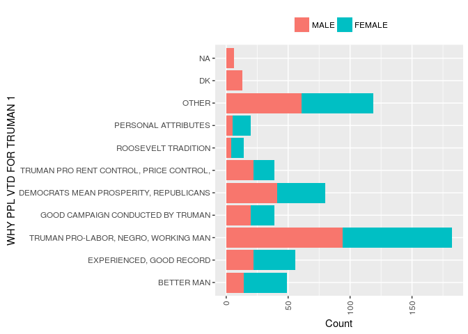

# rds.r
-   Overview
-   Install
-   Setup
-   Why RDS?
-   Querying data
    -   Dictionary
    -   Data
    -   Data With Code Values
    -   Sex of Respondent: Classification
-   Tabulating Data
-   Turning Tabulations into Charts

Overview
--------

Access data and metadata together in one quick call. With RDS there is no need to search for documentation to fill out the data, as it is provided to users through the same response as the data is. Variable and classification metadata can accompany any data that is queried through RDS through the use of a few simple parameters.

In this document we will be using data from the American National Election Study 1948 (ANES) that is stored on MTNA's public RDS server.

Install
-------

``` r
install.packages("rds.r")
```

Setup
-----

Libraries used for this markdown demonstration.

``` r
library(rds.r, quietly = TRUE, warn.conflicts = FALSE)
library(sjPlot, quietly = TRUE, warn.conflicts = FALSE)
```

    ## #refugeeswelcome

``` r
library(ggplot2, quietly = TRUE, warn.conflicts = FALSE)
library(plyr)
```

Why RDS?
--------

Traditionally when researchers want to analyze and evaluate data that is not their own they will have to complete several tasks before they can start their research.

-   Locate the data set they want to work with
-   Acquire the data and load it in R
-   Access the documentation and transcribe the documentation into a useful format in R

RDS cuts down the time it takes for reasearchers to locate and access the data of interest in a particular data set through its innovative querying capabilities and the metadata that can accompany every query.

Querying data
-------------

Lets imagine that we are researching the United States presidential election from 1948, between Harry Truman, and Thomas Dewey. We are interested in demographic data of the respondent and why they did or did not vote for Harry Truman. We may take a look at the documentation on the ANES website <http://www.electionstudies.org/studypages/1948prepost/nes1948.txt> which has a lot of good information about the variables and their codes stored in an ASCII format. However, to identify the variables of interest we would need to read through all 67 variables and their names and labels and choose the variables that have to do with respondent demographics or questions about Truman.

RDS will save you the trouble, instead of manually reading the variables information, we can request the variables and their metadata be returned to use by searching for keywords. This will return more than data, the variable and classification metadata will be available as well. This will allow us to document the variables we are using to provide ourselves and others with more context around the data we are using.

``` r
# For the purposes of this example we will use the 'selectSubset' function to
# ensure the table does not get too big for the HTML, for analysis we would use
# the 'select' function to return the entire data set.  data <-
# select('http://richdataservices.com/public/api/catalog/','test','anes1948',cols=$truman,$respondent')

# We will limit the variable properties returned to make our data dictionary more
# visually appealing
varProperties <- "id,label,question,storageType,width,classification"

dataSet <- selectSubset("http://richdataservices.com/public/api/catalog/", "test", 
    "anes1948", cols = "$truman,$respondent", limit = 10, varProperties = varProperties)

# Variable information
metadata <- dataSet@metadata
variableDocs <- rds:::variables(metadata)
varTable <- sjPlot::sjt.df(variableDocs, useViewer = F, describe = FALSE, encoding = "UTF-8", 
    no.output = TRUE, altr.row.col = TRUE, show.rownames = FALSE)$knitr

# Data
data <- dataSet@data
dataTable <- sjPlot::sjt.df(data, useViewer = F, describe = FALSE, encoding = "UTF-8", 
    no.output = TRUE, altr.row.col = TRUE, show.rownames = FALSE)$knitr
```

### Dictionary

<table style="border-collapse:collapse; border:none;">
<tr>
<th style="border-top: double; text-align:center; font-style:italic; font-weight:normal; padding:0.2cm; border-bottom:1px solid black;">
id
</th>
<th style="border-top: double; text-align:center; font-style:italic; font-weight:normal; padding:0.2cm; border-bottom:1px solid black;">
label
</th>
<th style="border-top: double; text-align:center; font-style:italic; font-weight:normal; padding:0.2cm; border-bottom:1px solid black;">
question
</th>
<th style="border-top: double; text-align:center; font-style:italic; font-weight:normal; padding:0.2cm; border-bottom:1px solid black;">
storageType
</th>
<th style="border-top: double; text-align:center; font-style:italic; font-weight:normal; padding:0.2cm; border-bottom:1px solid black;">
width
</th>
<th style="border-top: double; text-align:center; font-style:italic; font-weight:normal; padding:0.2cm; border-bottom:1px solid black;">
classification
</th>
</tr>
<tr>
<td style="padding:0.2cm; text-align:left; vertical-align:top; text-align:center;">
V480014a
</td>
<td style="padding:0.2cm; text-align:left; vertical-align:top; text-align:center;">
WHY PPL VTD FOR TRUMAN 1
</td>
<td style="padding:0.2cm; text-align:left; vertical-align:top; text-align:center;">
Q. 5. WHY DO YOU THINK PEOPLE VOTED FOR TRUMAN. Q. 5A. ARE THERE ANY OTHER KINDS OF REASONS WHY YOU THINK PEOPLE VOTED FOR TRUMAN.
</td>
<td style="padding:0.2cm; text-align:left; vertical-align:top; text-align:center;">
NUMERIC
</td>
<td style="padding:0.2cm; text-align:left; vertical-align:top; text-align:center;">
2
</td>
<td style="padding:0.2cm; text-align:left; vertical-align:top; text-align:center;">
V480014A
</td>
</tr>
<tr>
<td style="padding:0.2cm; text-align:left; vertical-align:top; text-align:center; background-color:#eaeaea;">
V480014b
</td>
<td style="padding:0.2cm; text-align:left; vertical-align:top; text-align:center; background-color:#eaeaea;">
WHY PPL VTD FOR TRUMAN 2
</td>
<td style="padding:0.2cm; text-align:left; vertical-align:top; text-align:center; background-color:#eaeaea;">
Q. 5. WHY DO YOU THINK PEOPLE VOTED FOR TRUMAN. Q. 5A. ARE THERE ANY OTHER KINDS OF REASONS WHY YOU THINK PEOPLE VOTED FOR TRUMAN.
</td>
<td style="padding:0.2cm; text-align:left; vertical-align:top; text-align:center; background-color:#eaeaea;">
NUMERIC
</td>
<td style="padding:0.2cm; text-align:left; vertical-align:top; text-align:center; background-color:#eaeaea;">
2
</td>
<td style="padding:0.2cm; text-align:left; vertical-align:top; text-align:center; background-color:#eaeaea;">
V480014B
</td>
</tr>
<tr>
<td style="padding:0.2cm; text-align:left; vertical-align:top; text-align:center;">
V480015a
</td>
<td style="padding:0.2cm; text-align:left; vertical-align:top; text-align:center;">
WHY PPL VTD AGNST TRUMAN 1
</td>
<td style="padding:0.2cm; text-align:left; vertical-align:top; text-align:center;">
Q. 6. DO YOU THINK THERE WAS ANYTHING SPECIAL ABOUT TRUMAN THAT MADE SOME PEOPLE VOTE AGAINST HIM.
</td>
<td style="padding:0.2cm; text-align:left; vertical-align:top; text-align:center;">
NUMERIC
</td>
<td style="padding:0.2cm; text-align:left; vertical-align:top; text-align:center;">
2
</td>
<td style="padding:0.2cm; text-align:left; vertical-align:top; text-align:center;">
V480015A
</td>
</tr>
<tr>
<td style="padding:0.2cm; text-align:left; vertical-align:top; text-align:center; background-color:#eaeaea;">
V480015b
</td>
<td style="padding:0.2cm; text-align:left; vertical-align:top; text-align:center; background-color:#eaeaea;">
WHY PPL VTD AGNST TRUMAN 2
</td>
<td style="padding:0.2cm; text-align:left; vertical-align:top; text-align:center; background-color:#eaeaea;">
Q. 6. DO YOU THINK THERE WAS ANYTHING SPECIAL ABOUT TRUMAN THAT MADE SOME PEOPLE VOTE AGAINST HIM.
</td>
<td style="padding:0.2cm; text-align:left; vertical-align:top; text-align:center; background-color:#eaeaea;">
NUMERIC
</td>
<td style="padding:0.2cm; text-align:left; vertical-align:top; text-align:center; background-color:#eaeaea;">
2
</td>
<td style="padding:0.2cm; text-align:left; vertical-align:top; text-align:center; background-color:#eaeaea;">
V480015B
</td>
</tr>
<tr>
<td style="padding:0.2cm; text-align:left; vertical-align:top; text-align:center;">
V480031a
</td>
<td style="padding:0.2cm; text-align:left; vertical-align:top; text-align:center;">
GRPS IDENTIFIED W TRUMAN 1
</td>
<td style="padding:0.2cm; text-align:left; vertical-align:top; text-align:center;">
1.  GROUPS IDENTIFIED WITH TRUMAN
    </td>
    <td style="padding:0.2cm; text-align:left; vertical-align:top; text-align:center;">
    NUMERIC
    </td>
    <td style="padding:0.2cm; text-align:left; vertical-align:top; text-align:center;">
    2
    </td>
    <td style="padding:0.2cm; text-align:left; vertical-align:top; text-align:center;">
    V480031A
    </td>
    </tr>
    <tr>
    <td style="padding:0.2cm; text-align:left; vertical-align:top; text-align:center; background-color:#eaeaea;">
    V480031b
    </td>
    <td style="padding:0.2cm; text-align:left; vertical-align:top; text-align:center; background-color:#eaeaea;">
    GRPS IDENTIFIED W TRUMAN 2
    </td>
    <td style="padding:0.2cm; text-align:left; vertical-align:top; text-align:center; background-color:#eaeaea;">
    1.  GROUPS IDENTIFIED WITH TRUMAN
        </td>
        <td style="padding:0.2cm; text-align:left; vertical-align:top; text-align:center; background-color:#eaeaea;">
        NUMERIC
        </td>
        <td style="padding:0.2cm; text-align:left; vertical-align:top; text-align:center; background-color:#eaeaea;">
        2
        </td>
        <td style="padding:0.2cm; text-align:left; vertical-align:top; text-align:center; background-color:#eaeaea;">
        V480031B
        </td>
        </tr>
        <tr>
        <td style="padding:0.2cm; text-align:left; vertical-align:top; text-align:center;">
        V480031c
        </td>
        <td style="padding:0.2cm; text-align:left; vertical-align:top; text-align:center;">
        GRPS IDENTIFIED W TRUMAN 3
        </td>
        <td style="padding:0.2cm; text-align:left; vertical-align:top; text-align:center;">
        1.  GROUPS IDENTIFIED WITH TRUMAN
            </td>
            <td style="padding:0.2cm; text-align:left; vertical-align:top; text-align:center;">
            NUMERIC
            </td>
            <td style="padding:0.2cm; text-align:left; vertical-align:top; text-align:center;">
            2
            </td>
            <td style="padding:0.2cm; text-align:left; vertical-align:top; text-align:center;">
            V480031C
            </td>
            </tr>
            <tr>
            <td style="padding:0.2cm; text-align:left; vertical-align:top; text-align:center; background-color:#eaeaea;">
            V480033a
            </td>
            <td style="padding:0.2cm; text-align:left; vertical-align:top; text-align:center; background-color:#eaeaea;">
            ISSUES CONNECTED W TRMN 1
            </td>
            <td style="padding:0.2cm; text-align:left; vertical-align:top; text-align:center; background-color:#eaeaea;">
            1.  ISSUES MENTIONED IN CONNECTION WITH TRUMAN
                </td>
                <td style="padding:0.2cm; text-align:left; vertical-align:top; text-align:center; background-color:#eaeaea;">
                NUMERIC
                </td>
                <td style="padding:0.2cm; text-align:left; vertical-align:top; text-align:center; background-color:#eaeaea;">
                2
                </td>
                <td style="padding:0.2cm; text-align:left; vertical-align:top; text-align:center; background-color:#eaeaea;">
                V480033A
                </td>
                </tr>
                <tr>
                <td style="padding:0.2cm; text-align:left; vertical-align:top; text-align:center;">
                V480033b
                </td>
                <td style="padding:0.2cm; text-align:left; vertical-align:top; text-align:center;">
                ISSUES CONNECTED W TRMN 2
                </td>
                <td style="padding:0.2cm; text-align:left; vertical-align:top; text-align:center;">
                1.  ISSUES MENTIONED IN CONNECTION WITH TRUMAN
                    </td>
                    <td style="padding:0.2cm; text-align:left; vertical-align:top; text-align:center;">
                    NUMERIC
                    </td>
                    <td style="padding:0.2cm; text-align:left; vertical-align:top; text-align:center;">
                    2
                    </td>
                    <td style="padding:0.2cm; text-align:left; vertical-align:top; text-align:center;">
                    V480033B
                    </td>
                    </tr>
                    <tr>
                    <td style="padding:0.2cm; text-align:left; vertical-align:top; text-align:center; background-color:#eaeaea;">
                    V480035a
                    </td>
                    <td style="padding:0.2cm; text-align:left; vertical-align:top; text-align:center; background-color:#eaeaea;">
                    PERSONAL ATTRIBUTE TRMN 1
                    </td>
                    <td style="padding:0.2cm; text-align:left; vertical-align:top; text-align:center; background-color:#eaeaea;">
                    1.  PERSONAL ATTRIBUTES OF TRUMAN
                        </td>
                        <td style="padding:0.2cm; text-align:left; vertical-align:top; text-align:center; background-color:#eaeaea;">
                        NUMERIC
                        </td>
                        <td style="padding:0.2cm; text-align:left; vertical-align:top; text-align:center; background-color:#eaeaea;">
                        2
                        </td>
                        <td style="padding:0.2cm; text-align:left; vertical-align:top; text-align:center; background-color:#eaeaea;">
                        V480035A
                        </td>
                        </tr>
                        <tr>
                        <td style="padding:0.2cm; text-align:left; vertical-align:top; text-align:center;">
                        V480035b
                        </td>
                        <td style="padding:0.2cm; text-align:left; vertical-align:top; text-align:center;">
                        PERSONAL ATTRIBUTE TRMN 2
                        </td>
                        <td style="padding:0.2cm; text-align:left; vertical-align:top; text-align:center;">
                        1.  PERSONAL ATTRIBUTES OF TRUMAN
                            </td>
                            <td style="padding:0.2cm; text-align:left; vertical-align:top; text-align:center;">
                            NUMERIC
                            </td>
                            <td style="padding:0.2cm; text-align:left; vertical-align:top; text-align:center;">
                            2
                            </td>
                            <td style="padding:0.2cm; text-align:left; vertical-align:top; text-align:center;">
                            V480035B
                            </td>
                            </tr>
                            <tr>
                            <td style="padding:0.2cm; text-align:left; vertical-align:top; text-align:center; background-color:#eaeaea;">
                            V480006
                            </td>
                            <td style="padding:0.2cm; text-align:left; vertical-align:top; text-align:center; background-color:#eaeaea;">
                            R REMEMBER PREVIOUS INT
                            </td>
                            <td style="padding:0.2cm; text-align:left; vertical-align:top; text-align:center; background-color:#eaeaea;">
                            INTERVIEWER -- DID THE RESPONDENT REMEMBER BEING INTERVIEWED PREVIOUSLY.
                            </td>
                            <td style="padding:0.2cm; text-align:left; vertical-align:top; text-align:center; background-color:#eaeaea;">
                            NUMERIC
                            </td>
                            <td style="padding:0.2cm; text-align:left; vertical-align:top; text-align:center; background-color:#eaeaea;">
                            1
                            </td>
                            <td style="padding:0.2cm; text-align:left; vertical-align:top; text-align:center; background-color:#eaeaea;">
                            V480006
                            </td>
                            </tr>
                            <tr>
                            <td style="padding:0.2cm; text-align:left; vertical-align:top; text-align:center;">
                            V480007
                            </td>
                            <td style="padding:0.2cm; text-align:left; vertical-align:top; text-align:center;">
                            INTR INTERVIEW THIS R
                            </td>
                            <td style="padding:0.2cm; text-align:left; vertical-align:top; text-align:center;">
                            INTERVIEWER -- DID YOU INTERVIEW THIS RESPONDENT.
                            </td>
                            <td style="padding:0.2cm; text-align:left; vertical-align:top; text-align:center;">
                            NUMERIC
                            </td>
                            <td style="padding:0.2cm; text-align:left; vertical-align:top; text-align:center;">
                            1
                            </td>
                            <td style="padding:0.2cm; text-align:left; vertical-align:top; text-align:center;">
                            V480007
                            </td>
                            </tr>
                            <tr>
                            <td style="padding:0.2cm; text-align:left; vertical-align:top; text-align:center; background-color:#eaeaea;">
                            V480008
                            </td>
                            <td style="padding:0.2cm; text-align:left; vertical-align:top; text-align:center; background-color:#eaeaea;">
                            PRVS PRE-ELCTN R REINT
                            </td>
                            <td style="padding:0.2cm; text-align:left; vertical-align:top; text-align:center; background-color:#eaeaea;">
                            INTERVIEWER -- WAS THE PREVIOUS PRE-ELECTION RESPONDENT RE-INTERVIEWED.
                            </td>
                            <td style="padding:0.2cm; text-align:left; vertical-align:top; text-align:center; background-color:#eaeaea;">
                            NUMERIC
                            </td>
                            <td style="padding:0.2cm; text-align:left; vertical-align:top; text-align:center; background-color:#eaeaea;">
                            1
                            </td>
                            <td style="padding:0.2cm; text-align:left; vertical-align:top; text-align:center; background-color:#eaeaea;">
                            V480008
                            </td>
                            </tr>
                            <tr>
                            <td style="padding:0.2cm; text-align:left; vertical-align:top; text-align:center;">
                            V480045
                            </td>
                            <td style="padding:0.2cm; text-align:left; vertical-align:top; text-align:center;">
                            SEX OF RESPONDENT
                            </td>
                            <td style="padding:0.2cm; text-align:left; vertical-align:top; text-align:center;">
                            Q. 1. SEX OF RESPONDENT
                            </td>
                            <td style="padding:0.2cm; text-align:left; vertical-align:top; text-align:center;">
                            NUMERIC
                            </td>
                            <td style="padding:0.2cm; text-align:left; vertical-align:top; text-align:center;">
                            1
                            </td>
                            <td style="padding:0.2cm; text-align:left; vertical-align:top; text-align:center;">
                            V480045
                            </td>
                            </tr>
                            <tr>
                            <td style="padding:0.2cm; text-align:left; vertical-align:top; text-align:center; background-color:#eaeaea;">
                            V480046
                            </td>
                            <td style="padding:0.2cm; text-align:left; vertical-align:top; text-align:center; background-color:#eaeaea;">
                            RACE OF RESPONDENT
                            </td>
                            <td style="padding:0.2cm; text-align:left; vertical-align:top; text-align:center; background-color:#eaeaea;">
                            Q. 2. RACE OF RESPONDENT
                            </td>
                            <td style="padding:0.2cm; text-align:left; vertical-align:top; text-align:center; background-color:#eaeaea;">
                            NUMERIC
                            </td>
                            <td style="padding:0.2cm; text-align:left; vertical-align:top; text-align:center; background-color:#eaeaea;">
                            1
                            </td>
                            <td style="padding:0.2cm; text-align:left; vertical-align:top; text-align:center; background-color:#eaeaea;">
                            V480046
                            </td>
                            </tr>
                            <tr>
                            <td style="padding:0.2cm; text-align:left; vertical-align:top; text-align:center;">
                            V480047
                            </td>
                            <td style="padding:0.2cm; text-align:left; vertical-align:top; text-align:center;">
                            AGE OF RESPONDENT
                            </td>
                            <td style="padding:0.2cm; text-align:left; vertical-align:top; text-align:center;">
                            Q. 3. AGE OF RESPONDENT
                            </td>
                            <td style="padding:0.2cm; text-align:left; vertical-align:top; text-align:center;">
                            NUMERIC
                            </td>
                            <td style="padding:0.2cm; text-align:left; vertical-align:top; text-align:center;">
                            1
                            </td>
                            <td style="padding:0.2cm; text-align:left; vertical-align:top; text-align:center;">
                            V480047
                            </td>
                            </tr>
                            <tr>
                            <td style="padding:0.2cm; text-align:left; vertical-align:top; text-align:center; background-color:#eaeaea;">
                            V480048
                            </td>
                            <td style="padding:0.2cm; text-align:left; vertical-align:top; text-align:center; background-color:#eaeaea;">
                            EDUCATION OF RESPONDENT
                            </td>
                            <td style="padding:0.2cm; text-align:left; vertical-align:top; text-align:center; background-color:#eaeaea;">
                            Q. 4. EDUCATION OF RESPONDENT
                            </td>
                            <td style="padding:0.2cm; text-align:left; vertical-align:top; text-align:center; background-color:#eaeaea;">
                            NUMERIC
                            </td>
                            <td style="padding:0.2cm; text-align:left; vertical-align:top; text-align:center; background-color:#eaeaea;">
                            1
                            </td>
                            <td style="padding:0.2cm; text-align:left; vertical-align:top; text-align:center; background-color:#eaeaea;">
                            V480048
                            </td>
                            </tr>
</table>

### Data

<table style="border-collapse:collapse; border:none;">
<tr>
<th style="border-top: double; text-align:center; font-style:italic; font-weight:normal; padding:0.2cm; border-bottom:1px solid black;">
V480014a
</th>
<th style="border-top: double; text-align:center; font-style:italic; font-weight:normal; padding:0.2cm; border-bottom:1px solid black;">
V480014b
</th>
<th style="border-top: double; text-align:center; font-style:italic; font-weight:normal; padding:0.2cm; border-bottom:1px solid black;">
V480015a
</th>
<th style="border-top: double; text-align:center; font-style:italic; font-weight:normal; padding:0.2cm; border-bottom:1px solid black;">
V480015b
</th>
<th style="border-top: double; text-align:center; font-style:italic; font-weight:normal; padding:0.2cm; border-bottom:1px solid black;">
V480031a
</th>
<th style="border-top: double; text-align:center; font-style:italic; font-weight:normal; padding:0.2cm; border-bottom:1px solid black;">
V480031b
</th>
<th style="border-top: double; text-align:center; font-style:italic; font-weight:normal; padding:0.2cm; border-bottom:1px solid black;">
V480031c
</th>
<th style="border-top: double; text-align:center; font-style:italic; font-weight:normal; padding:0.2cm; border-bottom:1px solid black;">
V480033a
</th>
<th style="border-top: double; text-align:center; font-style:italic; font-weight:normal; padding:0.2cm; border-bottom:1px solid black;">
V480033b
</th>
<th style="border-top: double; text-align:center; font-style:italic; font-weight:normal; padding:0.2cm; border-bottom:1px solid black;">
V480035a
</th>
<th style="border-top: double; text-align:center; font-style:italic; font-weight:normal; padding:0.2cm; border-bottom:1px solid black;">
V480035b
</th>
<th style="border-top: double; text-align:center; font-style:italic; font-weight:normal; padding:0.2cm; border-bottom:1px solid black;">
V480006
</th>
<th style="border-top: double; text-align:center; font-style:italic; font-weight:normal; padding:0.2cm; border-bottom:1px solid black;">
V480007
</th>
<th style="border-top: double; text-align:center; font-style:italic; font-weight:normal; padding:0.2cm; border-bottom:1px solid black;">
V480008
</th>
<th style="border-top: double; text-align:center; font-style:italic; font-weight:normal; padding:0.2cm; border-bottom:1px solid black;">
V480045
</th>
<th style="border-top: double; text-align:center; font-style:italic; font-weight:normal; padding:0.2cm; border-bottom:1px solid black;">
V480046
</th>
<th style="border-top: double; text-align:center; font-style:italic; font-weight:normal; padding:0.2cm; border-bottom:1px solid black;">
V480047
</th>
<th style="border-top: double; text-align:center; font-style:italic; font-weight:normal; padding:0.2cm; border-bottom:1px solid black;">
V480048
</th>
</tr>
<tr>
<td style="padding:0.2cm; text-align:left; vertical-align:top; text-align:center;">
30
</td>
<td style="padding:0.2cm; text-align:left; vertical-align:top; text-align:center;">
91
</td>
<td style="padding:0.2cm; text-align:left; vertical-align:top; text-align:center;">
98
</td>
<td style="padding:0.2cm; text-align:left; vertical-align:top; text-align:center;">
91
</td>
<td style="padding:0.2cm; text-align:left; vertical-align:top; text-align:center;">
10
</td>
<td style="padding:0.2cm; text-align:left; vertical-align:top; text-align:center;">
0
</td>
<td style="padding:0.2cm; text-align:left; vertical-align:top; text-align:center;">
0
</td>
<td style="padding:0.2cm; text-align:left; vertical-align:top; text-align:center;">
0
</td>
<td style="padding:0.2cm; text-align:left; vertical-align:top; text-align:center;">
0
</td>
<td style="padding:0.2cm; text-align:left; vertical-align:top; text-align:center;">
0
</td>
<td style="padding:0.2cm; text-align:left; vertical-align:top; text-align:center;">
0
</td>
<td style="padding:0.2cm; text-align:left; vertical-align:top; text-align:center;">
1
</td>
<td style="padding:0.2cm; text-align:left; vertical-align:top; text-align:center;">
9
</td>
<td style="padding:0.2cm; text-align:left; vertical-align:top; text-align:center;">
9
</td>
<td style="padding:0.2cm; text-align:left; vertical-align:top; text-align:center;">
1
</td>
<td style="padding:0.2cm; text-align:left; vertical-align:top; text-align:center;">
1
</td>
<td style="padding:0.2cm; text-align:left; vertical-align:top; text-align:center;">
3
</td>
<td style="padding:0.2cm; text-align:left; vertical-align:top; text-align:center;">
1
</td>
</tr>
<tr>
<td style="padding:0.2cm; text-align:left; vertical-align:top; text-align:center; background-color:#eaeaea;">
30
</td>
<td style="padding:0.2cm; text-align:left; vertical-align:top; text-align:center; background-color:#eaeaea;">
50
</td>
<td style="padding:0.2cm; text-align:left; vertical-align:top; text-align:center; background-color:#eaeaea;">
30
</td>
<td style="padding:0.2cm; text-align:left; vertical-align:top; text-align:center; background-color:#eaeaea;">
91
</td>
<td style="padding:0.2cm; text-align:left; vertical-align:top; text-align:center; background-color:#eaeaea;">
13
</td>
<td style="padding:0.2cm; text-align:left; vertical-align:top; text-align:center; background-color:#eaeaea;">
11
</td>
<td style="padding:0.2cm; text-align:left; vertical-align:top; text-align:center; background-color:#eaeaea;">
0
</td>
<td style="padding:0.2cm; text-align:left; vertical-align:top; text-align:center; background-color:#eaeaea;">
83
</td>
<td style="padding:0.2cm; text-align:left; vertical-align:top; text-align:center; background-color:#eaeaea;">
0
</td>
<td style="padding:0.2cm; text-align:left; vertical-align:top; text-align:center; background-color:#eaeaea;">
22
</td>
<td style="padding:0.2cm; text-align:left; vertical-align:top; text-align:center; background-color:#eaeaea;">
0
</td>
<td style="padding:0.2cm; text-align:left; vertical-align:top; text-align:center; background-color:#eaeaea;">
1
</td>
<td style="padding:0.2cm; text-align:left; vertical-align:top; text-align:center; background-color:#eaeaea;">
2
</td>
<td style="padding:0.2cm; text-align:left; vertical-align:top; text-align:center; background-color:#eaeaea;">
1
</td>
<td style="padding:0.2cm; text-align:left; vertical-align:top; text-align:center; background-color:#eaeaea;">
2
</td>
<td style="padding:0.2cm; text-align:left; vertical-align:top; text-align:center; background-color:#eaeaea;">
1
</td>
<td style="padding:0.2cm; text-align:left; vertical-align:top; text-align:center; background-color:#eaeaea;">
3
</td>
<td style="padding:0.2cm; text-align:left; vertical-align:top; text-align:center; background-color:#eaeaea;">
2
</td>
</tr>
<tr>
<td style="padding:0.2cm; text-align:left; vertical-align:top; text-align:center;">
10
</td>
<td style="padding:0.2cm; text-align:left; vertical-align:top; text-align:center;">
30
</td>
<td style="padding:0.2cm; text-align:left; vertical-align:top; text-align:center;">
30
</td>
<td style="padding:0.2cm; text-align:left; vertical-align:top; text-align:center;">
91
</td>
<td style="padding:0.2cm; text-align:left; vertical-align:top; text-align:center;">
10
</td>
<td style="padding:0.2cm; text-align:left; vertical-align:top; text-align:center;">
0
</td>
<td style="padding:0.2cm; text-align:left; vertical-align:top; text-align:center;">
0
</td>
<td style="padding:0.2cm; text-align:left; vertical-align:top; text-align:center;">
0
</td>
<td style="padding:0.2cm; text-align:left; vertical-align:top; text-align:center;">
0
</td>
<td style="padding:0.2cm; text-align:left; vertical-align:top; text-align:center;">
23
</td>
<td style="padding:0.2cm; text-align:left; vertical-align:top; text-align:center;">
0
</td>
<td style="padding:0.2cm; text-align:left; vertical-align:top; text-align:center;">
1
</td>
<td style="padding:0.2cm; text-align:left; vertical-align:top; text-align:center;">
1
</td>
<td style="padding:0.2cm; text-align:left; vertical-align:top; text-align:center;">
1
</td>
<td style="padding:0.2cm; text-align:left; vertical-align:top; text-align:center;">
2
</td>
<td style="padding:0.2cm; text-align:left; vertical-align:top; text-align:center;">
1
</td>
<td style="padding:0.2cm; text-align:left; vertical-align:top; text-align:center;">
2
</td>
<td style="padding:0.2cm; text-align:left; vertical-align:top; text-align:center;">
2
</td>
</tr>
<tr>
<td style="padding:0.2cm; text-align:left; vertical-align:top; text-align:center; background-color:#eaeaea;">
30
</td>
<td style="padding:0.2cm; text-align:left; vertical-align:top; text-align:center; background-color:#eaeaea;">
91
</td>
<td style="padding:0.2cm; text-align:left; vertical-align:top; text-align:center; background-color:#eaeaea;">
10
</td>
<td style="padding:0.2cm; text-align:left; vertical-align:top; text-align:center; background-color:#eaeaea;">
91
</td>
<td style="padding:0.2cm; text-align:left; vertical-align:top; text-align:center; background-color:#eaeaea;">
11
</td>
<td style="padding:0.2cm; text-align:left; vertical-align:top; text-align:center; background-color:#eaeaea;">
0
</td>
<td style="padding:0.2cm; text-align:left; vertical-align:top; text-align:center; background-color:#eaeaea;">
0
</td>
<td style="padding:0.2cm; text-align:left; vertical-align:top; text-align:center; background-color:#eaeaea;">
0
</td>
<td style="padding:0.2cm; text-align:left; vertical-align:top; text-align:center; background-color:#eaeaea;">
0
</td>
<td style="padding:0.2cm; text-align:left; vertical-align:top; text-align:center; background-color:#eaeaea;">
22
</td>
<td style="padding:0.2cm; text-align:left; vertical-align:top; text-align:center; background-color:#eaeaea;">
0
</td>
<td style="padding:0.2cm; text-align:left; vertical-align:top; text-align:center; background-color:#eaeaea;">
1
</td>
<td style="padding:0.2cm; text-align:left; vertical-align:top; text-align:center; background-color:#eaeaea;">
1
</td>
<td style="padding:0.2cm; text-align:left; vertical-align:top; text-align:center; background-color:#eaeaea;">
1
</td>
<td style="padding:0.2cm; text-align:left; vertical-align:top; text-align:center; background-color:#eaeaea;">
2
</td>
<td style="padding:0.2cm; text-align:left; vertical-align:top; text-align:center; background-color:#eaeaea;">
1
</td>
<td style="padding:0.2cm; text-align:left; vertical-align:top; text-align:center; background-color:#eaeaea;">
3
</td>
<td style="padding:0.2cm; text-align:left; vertical-align:top; text-align:center; background-color:#eaeaea;">
3
</td>
</tr>
<tr>
<td style="padding:0.2cm; text-align:left; vertical-align:top; text-align:center;">
30
</td>
<td style="padding:0.2cm; text-align:left; vertical-align:top; text-align:center;">
60
</td>
<td style="padding:0.2cm; text-align:left; vertical-align:top; text-align:center;">
10
</td>
<td style="padding:0.2cm; text-align:left; vertical-align:top; text-align:center;">
91
</td>
<td style="padding:0.2cm; text-align:left; vertical-align:top; text-align:center;">
11
</td>
<td style="padding:0.2cm; text-align:left; vertical-align:top; text-align:center;">
12
</td>
<td style="padding:0.2cm; text-align:left; vertical-align:top; text-align:center;">
0
</td>
<td style="padding:0.2cm; text-align:left; vertical-align:top; text-align:center;">
19
</td>
<td style="padding:0.2cm; text-align:left; vertical-align:top; text-align:center;">
83
</td>
<td style="padding:0.2cm; text-align:left; vertical-align:top; text-align:center;">
22
</td>
<td style="padding:0.2cm; text-align:left; vertical-align:top; text-align:center;">
0
</td>
<td style="padding:0.2cm; text-align:left; vertical-align:top; text-align:center;">
1
</td>
<td style="padding:0.2cm; text-align:left; vertical-align:top; text-align:center;">
2
</td>
<td style="padding:0.2cm; text-align:left; vertical-align:top; text-align:center;">
1
</td>
<td style="padding:0.2cm; text-align:left; vertical-align:top; text-align:center;">
1
</td>
<td style="padding:0.2cm; text-align:left; vertical-align:top; text-align:center;">
1
</td>
<td style="padding:0.2cm; text-align:left; vertical-align:top; text-align:center;">
2
</td>
<td style="padding:0.2cm; text-align:left; vertical-align:top; text-align:center;">
3
</td>
</tr>
<tr>
<td style="padding:0.2cm; text-align:left; vertical-align:top; text-align:center; background-color:#eaeaea;">
30
</td>
<td style="padding:0.2cm; text-align:left; vertical-align:top; text-align:center; background-color:#eaeaea;">
91
</td>
<td style="padding:0.2cm; text-align:left; vertical-align:top; text-align:center; background-color:#eaeaea;">
99
</td>
<td style="padding:0.2cm; text-align:left; vertical-align:top; text-align:center; background-color:#eaeaea;">
91
</td>
<td style="padding:0.2cm; text-align:left; vertical-align:top; text-align:center; background-color:#eaeaea;">
12
</td>
<td style="padding:0.2cm; text-align:left; vertical-align:top; text-align:center; background-color:#eaeaea;">
11
</td>
<td style="padding:0.2cm; text-align:left; vertical-align:top; text-align:center; background-color:#eaeaea;">
0
</td>
<td style="padding:0.2cm; text-align:left; vertical-align:top; text-align:center; background-color:#eaeaea;">
68
</td>
<td style="padding:0.2cm; text-align:left; vertical-align:top; text-align:center; background-color:#eaeaea;">
0
</td>
<td style="padding:0.2cm; text-align:left; vertical-align:top; text-align:center; background-color:#eaeaea;">
0
</td>
<td style="padding:0.2cm; text-align:left; vertical-align:top; text-align:center; background-color:#eaeaea;">
0
</td>
<td style="padding:0.2cm; text-align:left; vertical-align:top; text-align:center; background-color:#eaeaea;">
1
</td>
<td style="padding:0.2cm; text-align:left; vertical-align:top; text-align:center; background-color:#eaeaea;">
1
</td>
<td style="padding:0.2cm; text-align:left; vertical-align:top; text-align:center; background-color:#eaeaea;">
1
</td>
<td style="padding:0.2cm; text-align:left; vertical-align:top; text-align:center; background-color:#eaeaea;">
2
</td>
<td style="padding:0.2cm; text-align:left; vertical-align:top; text-align:center; background-color:#eaeaea;">
1
</td>
<td style="padding:0.2cm; text-align:left; vertical-align:top; text-align:center; background-color:#eaeaea;">
3
</td>
<td style="padding:0.2cm; text-align:left; vertical-align:top; text-align:center; background-color:#eaeaea;">
2
</td>
</tr>
<tr>
<td style="padding:0.2cm; text-align:left; vertical-align:top; text-align:center;">
98
</td>
<td style="padding:0.2cm; text-align:left; vertical-align:top; text-align:center;">
91
</td>
<td style="padding:0.2cm; text-align:left; vertical-align:top; text-align:center;">
90
</td>
<td style="padding:0.2cm; text-align:left; vertical-align:top; text-align:center;">
91
</td>
<td style="padding:0.2cm; text-align:left; vertical-align:top; text-align:center;">
0
</td>
<td style="padding:0.2cm; text-align:left; vertical-align:top; text-align:center;">
0
</td>
<td style="padding:0.2cm; text-align:left; vertical-align:top; text-align:center;">
0
</td>
<td style="padding:0.2cm; text-align:left; vertical-align:top; text-align:center;">
0
</td>
<td style="padding:0.2cm; text-align:left; vertical-align:top; text-align:center;">
0
</td>
<td style="padding:0.2cm; text-align:left; vertical-align:top; text-align:center;">
23
</td>
<td style="padding:0.2cm; text-align:left; vertical-align:top; text-align:center;">
0
</td>
<td style="padding:0.2cm; text-align:left; vertical-align:top; text-align:center;">
1
</td>
<td style="padding:0.2cm; text-align:left; vertical-align:top; text-align:center;">
1
</td>
<td style="padding:0.2cm; text-align:left; vertical-align:top; text-align:center;">
1
</td>
<td style="padding:0.2cm; text-align:left; vertical-align:top; text-align:center;">
1
</td>
<td style="padding:0.2cm; text-align:left; vertical-align:top; text-align:center;">
1
</td>
<td style="padding:0.2cm; text-align:left; vertical-align:top; text-align:center;">
4
</td>
<td style="padding:0.2cm; text-align:left; vertical-align:top; text-align:center;">
1
</td>
</tr>
<tr>
<td style="padding:0.2cm; text-align:left; vertical-align:top; text-align:center; background-color:#eaeaea;">
50
</td>
<td style="padding:0.2cm; text-align:left; vertical-align:top; text-align:center; background-color:#eaeaea;">
90
</td>
<td style="padding:0.2cm; text-align:left; vertical-align:top; text-align:center; background-color:#eaeaea;">
90
</td>
<td style="padding:0.2cm; text-align:left; vertical-align:top; text-align:center; background-color:#eaeaea;">
91
</td>
<td style="padding:0.2cm; text-align:left; vertical-align:top; text-align:center; background-color:#eaeaea;">
10
</td>
<td style="padding:0.2cm; text-align:left; vertical-align:top; text-align:center; background-color:#eaeaea;">
12
</td>
<td style="padding:0.2cm; text-align:left; vertical-align:top; text-align:center; background-color:#eaeaea;">
0
</td>
<td style="padding:0.2cm; text-align:left; vertical-align:top; text-align:center; background-color:#eaeaea;">
0
</td>
<td style="padding:0.2cm; text-align:left; vertical-align:top; text-align:center; background-color:#eaeaea;">
0
</td>
<td style="padding:0.2cm; text-align:left; vertical-align:top; text-align:center; background-color:#eaeaea;">
0
</td>
<td style="padding:0.2cm; text-align:left; vertical-align:top; text-align:center; background-color:#eaeaea;">
0
</td>
<td style="padding:0.2cm; text-align:left; vertical-align:top; text-align:center; background-color:#eaeaea;">
1
</td>
<td style="padding:0.2cm; text-align:left; vertical-align:top; text-align:center; background-color:#eaeaea;">
1
</td>
<td style="padding:0.2cm; text-align:left; vertical-align:top; text-align:center; background-color:#eaeaea;">
1
</td>
<td style="padding:0.2cm; text-align:left; vertical-align:top; text-align:center; background-color:#eaeaea;">
2
</td>
<td style="padding:0.2cm; text-align:left; vertical-align:top; text-align:center; background-color:#eaeaea;">
1
</td>
<td style="padding:0.2cm; text-align:left; vertical-align:top; text-align:center; background-color:#eaeaea;">
5
</td>
<td style="padding:0.2cm; text-align:left; vertical-align:top; text-align:center; background-color:#eaeaea;">
1
</td>
</tr>
<tr>
<td style="padding:0.2cm; text-align:left; vertical-align:top; text-align:center;">
50
</td>
<td style="padding:0.2cm; text-align:left; vertical-align:top; text-align:center;">
30
</td>
<td style="padding:0.2cm; text-align:left; vertical-align:top; text-align:center;">
30
</td>
<td style="padding:0.2cm; text-align:left; vertical-align:top; text-align:center;">
90
</td>
<td style="padding:0.2cm; text-align:left; vertical-align:top; text-align:center;">
10
</td>
<td style="padding:0.2cm; text-align:left; vertical-align:top; text-align:center;">
0
</td>
<td style="padding:0.2cm; text-align:left; vertical-align:top; text-align:center;">
0
</td>
<td style="padding:0.2cm; text-align:left; vertical-align:top; text-align:center;">
0
</td>
<td style="padding:0.2cm; text-align:left; vertical-align:top; text-align:center;">
0
</td>
<td style="padding:0.2cm; text-align:left; vertical-align:top; text-align:center;">
23
</td>
<td style="padding:0.2cm; text-align:left; vertical-align:top; text-align:center;">
0
</td>
<td style="padding:0.2cm; text-align:left; vertical-align:top; text-align:center;">
1
</td>
<td style="padding:0.2cm; text-align:left; vertical-align:top; text-align:center;">
1
</td>
<td style="padding:0.2cm; text-align:left; vertical-align:top; text-align:center;">
1
</td>
<td style="padding:0.2cm; text-align:left; vertical-align:top; text-align:center;">
1
</td>
<td style="padding:0.2cm; text-align:left; vertical-align:top; text-align:center;">
1
</td>
<td style="padding:0.2cm; text-align:left; vertical-align:top; text-align:center;">
2
</td>
<td style="padding:0.2cm; text-align:left; vertical-align:top; text-align:center;">
2
</td>
</tr>
<tr>
<td style="padding:0.2cm; text-align:left; vertical-align:top; text-align:center; background-color:#eaeaea;">
30
</td>
<td style="padding:0.2cm; text-align:left; vertical-align:top; text-align:center; background-color:#eaeaea;">
90
</td>
<td style="padding:0.2cm; text-align:left; vertical-align:top; text-align:center; background-color:#eaeaea;">
90
</td>
<td style="padding:0.2cm; text-align:left; vertical-align:top; text-align:center; background-color:#eaeaea;">
91
</td>
<td style="padding:0.2cm; text-align:left; vertical-align:top; text-align:center; background-color:#eaeaea;">
0
</td>
<td style="padding:0.2cm; text-align:left; vertical-align:top; text-align:center; background-color:#eaeaea;">
0
</td>
<td style="padding:0.2cm; text-align:left; vertical-align:top; text-align:center; background-color:#eaeaea;">
0
</td>
<td style="padding:0.2cm; text-align:left; vertical-align:top; text-align:center; background-color:#eaeaea;">
0
</td>
<td style="padding:0.2cm; text-align:left; vertical-align:top; text-align:center; background-color:#eaeaea;">
0
</td>
<td style="padding:0.2cm; text-align:left; vertical-align:top; text-align:center; background-color:#eaeaea;">
12
</td>
<td style="padding:0.2cm; text-align:left; vertical-align:top; text-align:center; background-color:#eaeaea;">
0
</td>
<td style="padding:0.2cm; text-align:left; vertical-align:top; text-align:center; background-color:#eaeaea;">
1
</td>
<td style="padding:0.2cm; text-align:left; vertical-align:top; text-align:center; background-color:#eaeaea;">
1
</td>
<td style="padding:0.2cm; text-align:left; vertical-align:top; text-align:center; background-color:#eaeaea;">
1
</td>
<td style="padding:0.2cm; text-align:left; vertical-align:top; text-align:center; background-color:#eaeaea;">
1
</td>
<td style="padding:0.2cm; text-align:left; vertical-align:top; text-align:center; background-color:#eaeaea;">
1
</td>
<td style="padding:0.2cm; text-align:left; vertical-align:top; text-align:center; background-color:#eaeaea;">
2
</td>
<td style="padding:0.2cm; text-align:left; vertical-align:top; text-align:center; background-color:#eaeaea;">
2
</td>
</tr>
</table>
### Data With Code Values

Maybe we want to know the code values for the codes of one or more of these variables, we have two options to do this.

First we could inject the code values into the returned data set as using the **inject** parameter.

``` r
dataSet <- selectSubset("http://richdataservices.com/public/api/catalog/", "test", 
    "anes1948", cols = "$truman,$respondent", limit = 10, metadata = TRUE, inject = TRUE)
```

    ## Warning in `levels<-`(`*tmp*`, value = if (nl == nL) as.character(labels)
    ## else paste0(labels, : duplicated levels in factors are deprecated

    ## Warning in `levels<-`(`*tmp*`, value = if (nl == nL) as.character(labels)
    ## else paste0(labels, : duplicated levels in factors are deprecated

``` r
data <- dataSet@data
dataTable <- sjPlot::sjt.df(data, useViewer = F, describe = FALSE, encoding = "UTF-8", 
    no.output = TRUE, altr.row.col = TRUE, show.rownames = FALSE)$knitr
```

<table style="border-collapse:collapse; border:none;">
<tr>
<th style="border-top: double; text-align:center; font-style:italic; font-weight:normal; padding:0.2cm; border-bottom:1px solid black;">
V480014a
</th>
<th style="border-top: double; text-align:center; font-style:italic; font-weight:normal; padding:0.2cm; border-bottom:1px solid black;">
V480014b
</th>
<th style="border-top: double; text-align:center; font-style:italic; font-weight:normal; padding:0.2cm; border-bottom:1px solid black;">
V480015a
</th>
<th style="border-top: double; text-align:center; font-style:italic; font-weight:normal; padding:0.2cm; border-bottom:1px solid black;">
V480015b
</th>
<th style="border-top: double; text-align:center; font-style:italic; font-weight:normal; padding:0.2cm; border-bottom:1px solid black;">
V480031a
</th>
<th style="border-top: double; text-align:center; font-style:italic; font-weight:normal; padding:0.2cm; border-bottom:1px solid black;">
V480031b
</th>
<th style="border-top: double; text-align:center; font-style:italic; font-weight:normal; padding:0.2cm; border-bottom:1px solid black;">
V480031c
</th>
<th style="border-top: double; text-align:center; font-style:italic; font-weight:normal; padding:0.2cm; border-bottom:1px solid black;">
V480033a
</th>
<th style="border-top: double; text-align:center; font-style:italic; font-weight:normal; padding:0.2cm; border-bottom:1px solid black;">
V480033b
</th>
<th style="border-top: double; text-align:center; font-style:italic; font-weight:normal; padding:0.2cm; border-bottom:1px solid black;">
V480035a
</th>
<th style="border-top: double; text-align:center; font-style:italic; font-weight:normal; padding:0.2cm; border-bottom:1px solid black;">
V480035b
</th>
<th style="border-top: double; text-align:center; font-style:italic; font-weight:normal; padding:0.2cm; border-bottom:1px solid black;">
V480006
</th>
<th style="border-top: double; text-align:center; font-style:italic; font-weight:normal; padding:0.2cm; border-bottom:1px solid black;">
V480007
</th>
<th style="border-top: double; text-align:center; font-style:italic; font-weight:normal; padding:0.2cm; border-bottom:1px solid black;">
V480008
</th>
<th style="border-top: double; text-align:center; font-style:italic; font-weight:normal; padding:0.2cm; border-bottom:1px solid black;">
V480045
</th>
<th style="border-top: double; text-align:center; font-style:italic; font-weight:normal; padding:0.2cm; border-bottom:1px solid black;">
V480046
</th>
<th style="border-top: double; text-align:center; font-style:italic; font-weight:normal; padding:0.2cm; border-bottom:1px solid black;">
V480047
</th>
<th style="border-top: double; text-align:center; font-style:italic; font-weight:normal; padding:0.2cm; border-bottom:1px solid black;">
V480048
</th>
</tr>
<tr>
<td style="padding:0.2cm; text-align:left; vertical-align:top; text-align:center;">
TRUMAN PRO-LABOR, NEGRO, WORKING MAN
</td>
<td style="padding:0.2cm; text-align:left; vertical-align:top; text-align:center;">
NO SECOND REASON
</td>
<td style="padding:0.2cm; text-align:left; vertical-align:top; text-align:center;">
DK
</td>
<td style="padding:0.2cm; text-align:left; vertical-align:top; text-align:center;">
NO SECOND REASON
</td>
<td style="padding:0.2cm; text-align:left; vertical-align:top; text-align:center;">
COMMON MAN, LITTLE PEOPLE
</td>
<td style="padding:0.2cm; text-align:left; vertical-align:top; text-align:center;">
NO GROUP, OR NO SECOND, THIRD GROUP
</td>
<td style="padding:0.2cm; text-align:left; vertical-align:top; text-align:center;">
NO GROUP, OR NO SECOND, THIRD GROUP
</td>
<td style="padding:0.2cm; text-align:left; vertical-align:top; text-align:center;">
NO ISSUE
</td>
<td style="padding:0.2cm; text-align:left; vertical-align:top; text-align:center;">
NO ISSUE
</td>
<td style="padding:0.2cm; text-align:left; vertical-align:top; text-align:center;">
NO ATTRIBUTE MENTIONED
</td>
<td style="padding:0.2cm; text-align:left; vertical-align:top; text-align:center;">
NO ATTRIBUTE MENTIONED
</td>
<td style="padding:0.2cm; text-align:left; vertical-align:top; text-align:center;">
YES
</td>
<td style="padding:0.2cm; text-align:left; vertical-align:top; text-align:center;">
NA
</td>
<td style="padding:0.2cm; text-align:left; vertical-align:top; text-align:center;">
NA
</td>
<td style="padding:0.2cm; text-align:left; vertical-align:top; text-align:center;">
MALE
</td>
<td style="padding:0.2cm; text-align:left; vertical-align:top; text-align:center;">
WHITE
</td>
<td style="padding:0.2cm; text-align:left; vertical-align:top; text-align:center;">
35-44
</td>
<td style="padding:0.2cm; text-align:left; vertical-align:top; text-align:center;">
GRADE SCHOOL
</td>
</tr>
<tr>
<td style="padding:0.2cm; text-align:left; vertical-align:top; text-align:center; background-color:#eaeaea;">
TRUMAN PRO-LABOR, NEGRO, WORKING MAN
</td>
<td style="padding:0.2cm; text-align:left; vertical-align:top; text-align:center; background-color:#eaeaea;">
DEMOCRATS MEAN PROSPERITY, REPUBLICANS
</td>
<td style="padding:0.2cm; text-align:left; vertical-align:top; text-align:center; background-color:#eaeaea;">
CAN'T GET THINGS DONE
</td>
<td style="padding:0.2cm; text-align:left; vertical-align:top; text-align:center; background-color:#eaeaea;">
NO SECOND REASON
</td>
<td style="padding:0.2cm; text-align:left; vertical-align:top; text-align:center; background-color:#eaeaea;">
GOVERNMENT WORKER
</td>
<td style="padding:0.2cm; text-align:left; vertical-align:top; text-align:center; background-color:#eaeaea;">
ORGANIZED LABOR, UNIONS
</td>
<td style="padding:0.2cm; text-align:left; vertical-align:top; text-align:center; background-color:#eaeaea;">
NO GROUP, OR NO SECOND, THIRD GROUP
</td>
<td style="padding:0.2cm; text-align:left; vertical-align:top; text-align:center; background-color:#eaeaea;">
TAFT-HARTLEY
</td>
<td style="padding:0.2cm; text-align:left; vertical-align:top; text-align:center; background-color:#eaeaea;">
NO ISSUE
</td>
<td style="padding:0.2cm; text-align:left; vertical-align:top; text-align:center; background-color:#eaeaea;">
SMALL, INCOMPETENT, INEFFICIENT
</td>
<td style="padding:0.2cm; text-align:left; vertical-align:top; text-align:center; background-color:#eaeaea;">
NO ATTRIBUTE MENTIONED
</td>
<td style="padding:0.2cm; text-align:left; vertical-align:top; text-align:center; background-color:#eaeaea;">
YES
</td>
<td style="padding:0.2cm; text-align:left; vertical-align:top; text-align:center; background-color:#eaeaea;">
NO
</td>
<td style="padding:0.2cm; text-align:left; vertical-align:top; text-align:center; background-color:#eaeaea;">
PREVIOUS RESPONDENT INTERVIEWED
</td>
<td style="padding:0.2cm; text-align:left; vertical-align:top; text-align:center; background-color:#eaeaea;">
FEMALE
</td>
<td style="padding:0.2cm; text-align:left; vertical-align:top; text-align:center; background-color:#eaeaea;">
WHITE
</td>
<td style="padding:0.2cm; text-align:left; vertical-align:top; text-align:center; background-color:#eaeaea;">
35-44
</td>
<td style="padding:0.2cm; text-align:left; vertical-align:top; text-align:center; background-color:#eaeaea;">
HIGH SCHOOL
</td>
</tr>
<tr>
<td style="padding:0.2cm; text-align:left; vertical-align:top; text-align:center;">
BETTER MAN
</td>
<td style="padding:0.2cm; text-align:left; vertical-align:top; text-align:center;">
TRUMAN PRO-LABOR, NEGRO, WORKING MAN
</td>
<td style="padding:0.2cm; text-align:left; vertical-align:top; text-align:center;">
CAN'T GET THINGS DONE
</td>
<td style="padding:0.2cm; text-align:left; vertical-align:top; text-align:center;">
NO SECOND REASON
</td>
<td style="padding:0.2cm; text-align:left; vertical-align:top; text-align:center;">
COMMON MAN, LITTLE PEOPLE
</td>
<td style="padding:0.2cm; text-align:left; vertical-align:top; text-align:center;">
NO GROUP, OR NO SECOND, THIRD GROUP
</td>
<td style="padding:0.2cm; text-align:left; vertical-align:top; text-align:center;">
NO GROUP, OR NO SECOND, THIRD GROUP
</td>
<td style="padding:0.2cm; text-align:left; vertical-align:top; text-align:center;">
NO ISSUE
</td>
<td style="padding:0.2cm; text-align:left; vertical-align:top; text-align:center;">
NO ISSUE
</td>
<td style="padding:0.2cm; text-align:left; vertical-align:top; text-align:center;">
INDECISIVE, VACILLATING, DOESN'T KNOW H
</td>
<td style="padding:0.2cm; text-align:left; vertical-align:top; text-align:center;">
NO ATTRIBUTE MENTIONED
</td>
<td style="padding:0.2cm; text-align:left; vertical-align:top; text-align:center;">
YES
</td>
<td style="padding:0.2cm; text-align:left; vertical-align:top; text-align:center;">
YES
</td>
<td style="padding:0.2cm; text-align:left; vertical-align:top; text-align:center;">
PREVIOUS RESPONDENT INTERVIEWED
</td>
<td style="padding:0.2cm; text-align:left; vertical-align:top; text-align:center;">
FEMALE
</td>
<td style="padding:0.2cm; text-align:left; vertical-align:top; text-align:center;">
WHITE
</td>
<td style="padding:0.2cm; text-align:left; vertical-align:top; text-align:center;">
25-34
</td>
<td style="padding:0.2cm; text-align:left; vertical-align:top; text-align:center;">
HIGH SCHOOL
</td>
</tr>
<tr>
<td style="padding:0.2cm; text-align:left; vertical-align:top; text-align:center; background-color:#eaeaea;">
TRUMAN PRO-LABOR, NEGRO, WORKING MAN
</td>
<td style="padding:0.2cm; text-align:left; vertical-align:top; text-align:center; background-color:#eaeaea;">
NO SECOND REASON
</td>
<td style="padding:0.2cm; text-align:left; vertical-align:top; text-align:center; background-color:#eaeaea;">
SMALL MAN, INADEQUATE BACKGROUND
</td>
<td style="padding:0.2cm; text-align:left; vertical-align:top; text-align:center; background-color:#eaeaea;">
NO SECOND REASON
</td>
<td style="padding:0.2cm; text-align:left; vertical-align:top; text-align:center; background-color:#eaeaea;">
ORGANIZED LABOR, UNIONS
</td>
<td style="padding:0.2cm; text-align:left; vertical-align:top; text-align:center; background-color:#eaeaea;">
NO GROUP, OR NO SECOND, THIRD GROUP
</td>
<td style="padding:0.2cm; text-align:left; vertical-align:top; text-align:center; background-color:#eaeaea;">
NO GROUP, OR NO SECOND, THIRD GROUP
</td>
<td style="padding:0.2cm; text-align:left; vertical-align:top; text-align:center; background-color:#eaeaea;">
NO ISSUE
</td>
<td style="padding:0.2cm; text-align:left; vertical-align:top; text-align:center; background-color:#eaeaea;">
NO ISSUE
</td>
<td style="padding:0.2cm; text-align:left; vertical-align:top; text-align:center; background-color:#eaeaea;">
SMALL, INCOMPETENT, INEFFICIENT
</td>
<td style="padding:0.2cm; text-align:left; vertical-align:top; text-align:center; background-color:#eaeaea;">
NO ATTRIBUTE MENTIONED
</td>
<td style="padding:0.2cm; text-align:left; vertical-align:top; text-align:center; background-color:#eaeaea;">
YES
</td>
<td style="padding:0.2cm; text-align:left; vertical-align:top; text-align:center; background-color:#eaeaea;">
YES
</td>
<td style="padding:0.2cm; text-align:left; vertical-align:top; text-align:center; background-color:#eaeaea;">
PREVIOUS RESPONDENT INTERVIEWED
</td>
<td style="padding:0.2cm; text-align:left; vertical-align:top; text-align:center; background-color:#eaeaea;">
FEMALE
</td>
<td style="padding:0.2cm; text-align:left; vertical-align:top; text-align:center; background-color:#eaeaea;">
WHITE
</td>
<td style="padding:0.2cm; text-align:left; vertical-align:top; text-align:center; background-color:#eaeaea;">
35-44
</td>
<td style="padding:0.2cm; text-align:left; vertical-align:top; text-align:center; background-color:#eaeaea;">
COLLEGE
</td>
</tr>
<tr>
<td style="padding:0.2cm; text-align:left; vertical-align:top; text-align:center;">
TRUMAN PRO-LABOR, NEGRO, WORKING MAN
</td>
<td style="padding:0.2cm; text-align:left; vertical-align:top; text-align:center;">
TRUMAN PRO RENT CONTROL, PRICE CONTROL,
</td>
<td style="padding:0.2cm; text-align:left; vertical-align:top; text-align:center;">
SMALL MAN, INADEQUATE BACKGROUND
</td>
<td style="padding:0.2cm; text-align:left; vertical-align:top; text-align:center;">
NO SECOND REASON
</td>
<td style="padding:0.2cm; text-align:left; vertical-align:top; text-align:center;">
ORGANIZED LABOR, UNIONS
</td>
<td style="padding:0.2cm; text-align:left; vertical-align:top; text-align:center;">
FARMER
</td>
<td style="padding:0.2cm; text-align:left; vertical-align:top; text-align:center;">
NO GROUP, OR NO SECOND, THIRD GROUP
</td>
<td style="padding:0.2cm; text-align:left; vertical-align:top; text-align:center;">
FARM PRICES AND SUPPORT
</td>
<td style="padding:0.2cm; text-align:left; vertical-align:top; text-align:center;">
TAFT-HARTLEY
</td>
<td style="padding:0.2cm; text-align:left; vertical-align:top; text-align:center;">
SMALL, INCOMPETENT, INEFFICIENT
</td>
<td style="padding:0.2cm; text-align:left; vertical-align:top; text-align:center;">
NO ATTRIBUTE MENTIONED
</td>
<td style="padding:0.2cm; text-align:left; vertical-align:top; text-align:center;">
YES
</td>
<td style="padding:0.2cm; text-align:left; vertical-align:top; text-align:center;">
NO
</td>
<td style="padding:0.2cm; text-align:left; vertical-align:top; text-align:center;">
PREVIOUS RESPONDENT INTERVIEWED
</td>
<td style="padding:0.2cm; text-align:left; vertical-align:top; text-align:center;">
MALE
</td>
<td style="padding:0.2cm; text-align:left; vertical-align:top; text-align:center;">
WHITE
</td>
<td style="padding:0.2cm; text-align:left; vertical-align:top; text-align:center;">
25-34
</td>
<td style="padding:0.2cm; text-align:left; vertical-align:top; text-align:center;">
COLLEGE
</td>
</tr>
<tr>
<td style="padding:0.2cm; text-align:left; vertical-align:top; text-align:center; background-color:#eaeaea;">
TRUMAN PRO-LABOR, NEGRO, WORKING MAN
</td>
<td style="padding:0.2cm; text-align:left; vertical-align:top; text-align:center; background-color:#eaeaea;">
NO SECOND REASON
</td>
<td style="padding:0.2cm; text-align:left; vertical-align:top; text-align:center; background-color:#eaeaea;">
NA
</td>
<td style="padding:0.2cm; text-align:left; vertical-align:top; text-align:center; background-color:#eaeaea;">
NO SECOND REASON
</td>
<td style="padding:0.2cm; text-align:left; vertical-align:top; text-align:center; background-color:#eaeaea;">
FARMER
</td>
<td style="padding:0.2cm; text-align:left; vertical-align:top; text-align:center; background-color:#eaeaea;">
ORGANIZED LABOR, UNIONS
</td>
<td style="padding:0.2cm; text-align:left; vertical-align:top; text-align:center; background-color:#eaeaea;">
NO GROUP, OR NO SECOND, THIRD GROUP
</td>
<td style="padding:0.2cm; text-align:left; vertical-align:top; text-align:center; background-color:#eaeaea;">
TAFT-HARTLEY
</td>
<td style="padding:0.2cm; text-align:left; vertical-align:top; text-align:center; background-color:#eaeaea;">
NO ISSUE
</td>
<td style="padding:0.2cm; text-align:left; vertical-align:top; text-align:center; background-color:#eaeaea;">
NO ATTRIBUTE MENTIONED
</td>
<td style="padding:0.2cm; text-align:left; vertical-align:top; text-align:center; background-color:#eaeaea;">
NO ATTRIBUTE MENTIONED
</td>
<td style="padding:0.2cm; text-align:left; vertical-align:top; text-align:center; background-color:#eaeaea;">
YES
</td>
<td style="padding:0.2cm; text-align:left; vertical-align:top; text-align:center; background-color:#eaeaea;">
YES
</td>
<td style="padding:0.2cm; text-align:left; vertical-align:top; text-align:center; background-color:#eaeaea;">
PREVIOUS RESPONDENT INTERVIEWED
</td>
<td style="padding:0.2cm; text-align:left; vertical-align:top; text-align:center; background-color:#eaeaea;">
FEMALE
</td>
<td style="padding:0.2cm; text-align:left; vertical-align:top; text-align:center; background-color:#eaeaea;">
WHITE
</td>
<td style="padding:0.2cm; text-align:left; vertical-align:top; text-align:center; background-color:#eaeaea;">
35-44
</td>
<td style="padding:0.2cm; text-align:left; vertical-align:top; text-align:center; background-color:#eaeaea;">
HIGH SCHOOL
</td>
</tr>
<tr>
<td style="padding:0.2cm; text-align:left; vertical-align:top; text-align:center;">
DK
</td>
<td style="padding:0.2cm; text-align:left; vertical-align:top; text-align:center;">
NO SECOND REASON
</td>
<td style="padding:0.2cm; text-align:left; vertical-align:top; text-align:center;">
OTHER REASONS
</td>
<td style="padding:0.2cm; text-align:left; vertical-align:top; text-align:center;">
NO SECOND REASON
</td>
<td style="padding:0.2cm; text-align:left; vertical-align:top; text-align:center;">
NO GROUP, OR NO SECOND, THIRD GROUP
</td>
<td style="padding:0.2cm; text-align:left; vertical-align:top; text-align:center;">
NO GROUP, OR NO SECOND, THIRD GROUP
</td>
<td style="padding:0.2cm; text-align:left; vertical-align:top; text-align:center;">
NO GROUP, OR NO SECOND, THIRD GROUP
</td>
<td style="padding:0.2cm; text-align:left; vertical-align:top; text-align:center;">
NO ISSUE
</td>
<td style="padding:0.2cm; text-align:left; vertical-align:top; text-align:center;">
NO ISSUE
</td>
<td style="padding:0.2cm; text-align:left; vertical-align:top; text-align:center;">
INDECISIVE, VACILLATING, DOESN'T KNOW H
</td>
<td style="padding:0.2cm; text-align:left; vertical-align:top; text-align:center;">
NO ATTRIBUTE MENTIONED
</td>
<td style="padding:0.2cm; text-align:left; vertical-align:top; text-align:center;">
YES
</td>
<td style="padding:0.2cm; text-align:left; vertical-align:top; text-align:center;">
YES
</td>
<td style="padding:0.2cm; text-align:left; vertical-align:top; text-align:center;">
PREVIOUS RESPONDENT INTERVIEWED
</td>
<td style="padding:0.2cm; text-align:left; vertical-align:top; text-align:center;">
MALE
</td>
<td style="padding:0.2cm; text-align:left; vertical-align:top; text-align:center;">
WHITE
</td>
<td style="padding:0.2cm; text-align:left; vertical-align:top; text-align:center;">
45-54
</td>
<td style="padding:0.2cm; text-align:left; vertical-align:top; text-align:center;">
GRADE SCHOOL
</td>
</tr>
<tr>
<td style="padding:0.2cm; text-align:left; vertical-align:top; text-align:center; background-color:#eaeaea;">
DEMOCRATS MEAN PROSPERITY, REPUBLICANS
</td>
<td style="padding:0.2cm; text-align:left; vertical-align:top; text-align:center; background-color:#eaeaea;">
OTHER
</td>
<td style="padding:0.2cm; text-align:left; vertical-align:top; text-align:center; background-color:#eaeaea;">
OTHER REASONS
</td>
<td style="padding:0.2cm; text-align:left; vertical-align:top; text-align:center; background-color:#eaeaea;">
NO SECOND REASON
</td>
<td style="padding:0.2cm; text-align:left; vertical-align:top; text-align:center; background-color:#eaeaea;">
COMMON MAN, LITTLE PEOPLE
</td>
<td style="padding:0.2cm; text-align:left; vertical-align:top; text-align:center; background-color:#eaeaea;">
FARMER
</td>
<td style="padding:0.2cm; text-align:left; vertical-align:top; text-align:center; background-color:#eaeaea;">
NO GROUP, OR NO SECOND, THIRD GROUP
</td>
<td style="padding:0.2cm; text-align:left; vertical-align:top; text-align:center; background-color:#eaeaea;">
NO ISSUE
</td>
<td style="padding:0.2cm; text-align:left; vertical-align:top; text-align:center; background-color:#eaeaea;">
NO ISSUE
</td>
<td style="padding:0.2cm; text-align:left; vertical-align:top; text-align:center; background-color:#eaeaea;">
NO ATTRIBUTE MENTIONED
</td>
<td style="padding:0.2cm; text-align:left; vertical-align:top; text-align:center; background-color:#eaeaea;">
NO ATTRIBUTE MENTIONED
</td>
<td style="padding:0.2cm; text-align:left; vertical-align:top; text-align:center; background-color:#eaeaea;">
YES
</td>
<td style="padding:0.2cm; text-align:left; vertical-align:top; text-align:center; background-color:#eaeaea;">
YES
</td>
<td style="padding:0.2cm; text-align:left; vertical-align:top; text-align:center; background-color:#eaeaea;">
PREVIOUS RESPONDENT INTERVIEWED
</td>
<td style="padding:0.2cm; text-align:left; vertical-align:top; text-align:center; background-color:#eaeaea;">
FEMALE
</td>
<td style="padding:0.2cm; text-align:left; vertical-align:top; text-align:center; background-color:#eaeaea;">
WHITE
</td>
<td style="padding:0.2cm; text-align:left; vertical-align:top; text-align:center; background-color:#eaeaea;">
55-64
</td>
<td style="padding:0.2cm; text-align:left; vertical-align:top; text-align:center; background-color:#eaeaea;">
GRADE SCHOOL
</td>
</tr>
<tr>
<td style="padding:0.2cm; text-align:left; vertical-align:top; text-align:center;">
DEMOCRATS MEAN PROSPERITY, REPUBLICANS
</td>
<td style="padding:0.2cm; text-align:left; vertical-align:top; text-align:center;">
TRUMAN PRO-LABOR, NEGRO, WORKING MAN
</td>
<td style="padding:0.2cm; text-align:left; vertical-align:top; text-align:center;">
CAN'T GET THINGS DONE
</td>
<td style="padding:0.2cm; text-align:left; vertical-align:top; text-align:center;">
OTHER REASONS
</td>
<td style="padding:0.2cm; text-align:left; vertical-align:top; text-align:center;">
COMMON MAN, LITTLE PEOPLE
</td>
<td style="padding:0.2cm; text-align:left; vertical-align:top; text-align:center;">
NO GROUP, OR NO SECOND, THIRD GROUP
</td>
<td style="padding:0.2cm; text-align:left; vertical-align:top; text-align:center;">
NO GROUP, OR NO SECOND, THIRD GROUP
</td>
<td style="padding:0.2cm; text-align:left; vertical-align:top; text-align:center;">
NO ISSUE
</td>
<td style="padding:0.2cm; text-align:left; vertical-align:top; text-align:center;">
NO ISSUE
</td>
<td style="padding:0.2cm; text-align:left; vertical-align:top; text-align:center;">
INDECISIVE, VACILLATING, DOESN'T KNOW H
</td>
<td style="padding:0.2cm; text-align:left; vertical-align:top; text-align:center;">
NO ATTRIBUTE MENTIONED
</td>
<td style="padding:0.2cm; text-align:left; vertical-align:top; text-align:center;">
YES
</td>
<td style="padding:0.2cm; text-align:left; vertical-align:top; text-align:center;">
YES
</td>
<td style="padding:0.2cm; text-align:left; vertical-align:top; text-align:center;">
PREVIOUS RESPONDENT INTERVIEWED
</td>
<td style="padding:0.2cm; text-align:left; vertical-align:top; text-align:center;">
MALE
</td>
<td style="padding:0.2cm; text-align:left; vertical-align:top; text-align:center;">
WHITE
</td>
<td style="padding:0.2cm; text-align:left; vertical-align:top; text-align:center;">
25-34
</td>
<td style="padding:0.2cm; text-align:left; vertical-align:top; text-align:center;">
HIGH SCHOOL
</td>
</tr>
<tr>
<td style="padding:0.2cm; text-align:left; vertical-align:top; text-align:center; background-color:#eaeaea;">
TRUMAN PRO-LABOR, NEGRO, WORKING MAN
</td>
<td style="padding:0.2cm; text-align:left; vertical-align:top; text-align:center; background-color:#eaeaea;">
OTHER
</td>
<td style="padding:0.2cm; text-align:left; vertical-align:top; text-align:center; background-color:#eaeaea;">
OTHER REASONS
</td>
<td style="padding:0.2cm; text-align:left; vertical-align:top; text-align:center; background-color:#eaeaea;">
NO SECOND REASON
</td>
<td style="padding:0.2cm; text-align:left; vertical-align:top; text-align:center; background-color:#eaeaea;">
NO GROUP, OR NO SECOND, THIRD GROUP
</td>
<td style="padding:0.2cm; text-align:left; vertical-align:top; text-align:center; background-color:#eaeaea;">
NO GROUP, OR NO SECOND, THIRD GROUP
</td>
<td style="padding:0.2cm; text-align:left; vertical-align:top; text-align:center; background-color:#eaeaea;">
NO GROUP, OR NO SECOND, THIRD GROUP
</td>
<td style="padding:0.2cm; text-align:left; vertical-align:top; text-align:center; background-color:#eaeaea;">
NO ISSUE
</td>
<td style="padding:0.2cm; text-align:left; vertical-align:top; text-align:center; background-color:#eaeaea;">
NO ISSUE
</td>
<td style="padding:0.2cm; text-align:left; vertical-align:top; text-align:center; background-color:#eaeaea;">
EXPERIENCED, CAPABLE, COMPETENT, INTELL
</td>
<td style="padding:0.2cm; text-align:left; vertical-align:top; text-align:center; background-color:#eaeaea;">
NO ATTRIBUTE MENTIONED
</td>
<td style="padding:0.2cm; text-align:left; vertical-align:top; text-align:center; background-color:#eaeaea;">
YES
</td>
<td style="padding:0.2cm; text-align:left; vertical-align:top; text-align:center; background-color:#eaeaea;">
YES
</td>
<td style="padding:0.2cm; text-align:left; vertical-align:top; text-align:center; background-color:#eaeaea;">
PREVIOUS RESPONDENT INTERVIEWED
</td>
<td style="padding:0.2cm; text-align:left; vertical-align:top; text-align:center; background-color:#eaeaea;">
MALE
</td>
<td style="padding:0.2cm; text-align:left; vertical-align:top; text-align:center; background-color:#eaeaea;">
WHITE
</td>
<td style="padding:0.2cm; text-align:left; vertical-align:top; text-align:center; background-color:#eaeaea;">
25-34
</td>
<td style="padding:0.2cm; text-align:left; vertical-align:top; text-align:center; background-color:#eaeaea;">
HIGH SCHOOL
</td>
</tr>
</table>
### Sex of Respondent: Classification

We could also simply access the classification information for a given variable.

``` r
# Variable information
metadata <- dataSet@metadata
V480045 <- rds:::variable(metadata, "V480045")
classification <- rds:::classification(metadata, V480045$classification)
classTable <- sjPlot::sjt.df(classification@codes, useViewer = F, describe = FALSE, 
    encoding = "UTF-8", no.output = TRUE, altr.row.col = TRUE, show.rownames = FALSE)$knitr
```

<table style="border-collapse:collapse; border:none;">
<tr>
<th style="border-top: double; text-align:center; font-style:italic; font-weight:normal; padding:0.2cm; border-bottom:1px solid black;">
value
</th>
<th style="border-top: double; text-align:center; font-style:italic; font-weight:normal; padding:0.2cm; border-bottom:1px solid black;">
label
</th>
</tr>
<tr>
<td style="padding:0.2cm; text-align:left; vertical-align:top; text-align:center;">
1
</td>
<td style="padding:0.2cm; text-align:left; vertical-align:top; text-align:center;">
MALE
</td>
</tr>
<tr>
<td style="padding:0.2cm; text-align:left; vertical-align:top; text-align:center; background-color:#eaeaea;">
2
</td>
<td style="padding:0.2cm; text-align:left; vertical-align:top; text-align:center; background-color:#eaeaea;">
FEMALE
</td>
</tr>
<tr>
<td style="padding:0.2cm; text-align:left; vertical-align:top; text-align:center;">
9
</td>
<td style="padding:0.2cm; text-align:left; vertical-align:top; text-align:center;">
NA
</td>
</tr>
</table>
Tabulating Data
---------------

Perhaps we would like to know if there is any difference between why male and female respondents think people voted for Truman. First lets create the table using the **tabulate** function.

``` r
tabulation <- tabulate("http://richdataservices.com/public/api/catalog/", "test", 
    "anes1948", dimensions = "V480045,V480014a", inject = TRUE)
data <- tabulation@data
table <- sjPlot::sjt.df(data, useViewer = F, describe = FALSE, encoding = "UTF-8", 
    no.output = TRUE, altr.row.col = TRUE, show.rownames = FALSE)$knitr
```

<table style="border-collapse:collapse; border:none;">
<tr>
<th style="border-top: double; text-align:center; font-style:italic; font-weight:normal; padding:0.2cm; border-bottom:1px solid black;">
V480045
</th>
<th style="border-top: double; text-align:center; font-style:italic; font-weight:normal; padding:0.2cm; border-bottom:1px solid black;">
V480014a
</th>
<th style="border-top: double; text-align:center; font-style:italic; font-weight:normal; padding:0.2cm; border-bottom:1px solid black;">
count
</th>
</tr>
<tr>
<td style="padding:0.2cm; text-align:left; vertical-align:top; text-align:center;">
MALE
</td>
<td style="padding:0.2cm; text-align:left; vertical-align:top; text-align:center;">
BETTER MAN
</td>
<td style="padding:0.2cm; text-align:left; vertical-align:top; text-align:center;">
14
</td>
</tr>
<tr>
<td style="padding:0.2cm; text-align:left; vertical-align:top; text-align:center; background-color:#eaeaea;">
MALE
</td>
<td style="padding:0.2cm; text-align:left; vertical-align:top; text-align:center; background-color:#eaeaea;">
EXPERIENCED, GOOD RECORD
</td>
<td style="padding:0.2cm; text-align:left; vertical-align:top; text-align:center; background-color:#eaeaea;">
22
</td>
</tr>
<tr>
<td style="padding:0.2cm; text-align:left; vertical-align:top; text-align:center;">
MALE
</td>
<td style="padding:0.2cm; text-align:left; vertical-align:top; text-align:center;">
TRUMAN PRO-LABOR, NEGRO, WORKING MAN
</td>
<td style="padding:0.2cm; text-align:left; vertical-align:top; text-align:center;">
94
</td>
</tr>
<tr>
<td style="padding:0.2cm; text-align:left; vertical-align:top; text-align:center; background-color:#eaeaea;">
MALE
</td>
<td style="padding:0.2cm; text-align:left; vertical-align:top; text-align:center; background-color:#eaeaea;">
GOOD CAMPAIGN CONDUCTED BY TRUMAN
</td>
<td style="padding:0.2cm; text-align:left; vertical-align:top; text-align:center; background-color:#eaeaea;">
20
</td>
</tr>
<tr>
<td style="padding:0.2cm; text-align:left; vertical-align:top; text-align:center;">
MALE
</td>
<td style="padding:0.2cm; text-align:left; vertical-align:top; text-align:center;">
DEMOCRATS MEAN PROSPERITY, REPUBLICANS
</td>
<td style="padding:0.2cm; text-align:left; vertical-align:top; text-align:center;">
41
</td>
</tr>
<tr>
<td style="padding:0.2cm; text-align:left; vertical-align:top; text-align:center; background-color:#eaeaea;">
MALE
</td>
<td style="padding:0.2cm; text-align:left; vertical-align:top; text-align:center; background-color:#eaeaea;">
TRUMAN PRO RENT CONTROL, PRICE CONTROL,
</td>
<td style="padding:0.2cm; text-align:left; vertical-align:top; text-align:center; background-color:#eaeaea;">
22
</td>
</tr>
<tr>
<td style="padding:0.2cm; text-align:left; vertical-align:top; text-align:center;">
MALE
</td>
<td style="padding:0.2cm; text-align:left; vertical-align:top; text-align:center;">
ROOSEVELT TRADITION
</td>
<td style="padding:0.2cm; text-align:left; vertical-align:top; text-align:center;">
4
</td>
</tr>
<tr>
<td style="padding:0.2cm; text-align:left; vertical-align:top; text-align:center; background-color:#eaeaea;">
MALE
</td>
<td style="padding:0.2cm; text-align:left; vertical-align:top; text-align:center; background-color:#eaeaea;">
PERSONAL ATTRIBUTES
</td>
<td style="padding:0.2cm; text-align:left; vertical-align:top; text-align:center; background-color:#eaeaea;">
5
</td>
</tr>
<tr>
<td style="padding:0.2cm; text-align:left; vertical-align:top; text-align:center;">
MALE
</td>
<td style="padding:0.2cm; text-align:left; vertical-align:top; text-align:center;">
OTHER
</td>
<td style="padding:0.2cm; text-align:left; vertical-align:top; text-align:center;">
61
</td>
</tr>
<tr>
<td style="padding:0.2cm; text-align:left; vertical-align:top; text-align:center; background-color:#eaeaea;">
MALE
</td>
<td style="padding:0.2cm; text-align:left; vertical-align:top; text-align:center; background-color:#eaeaea;">
DK
</td>
<td style="padding:0.2cm; text-align:left; vertical-align:top; text-align:center; background-color:#eaeaea;">
13
</td>
</tr>
<tr>
<td style="padding:0.2cm; text-align:left; vertical-align:top; text-align:center;">
MALE
</td>
<td style="padding:0.2cm; text-align:left; vertical-align:top; text-align:center;">
NA
</td>
<td style="padding:0.2cm; text-align:left; vertical-align:top; text-align:center;">
6
</td>
</tr>
<tr>
<td style="padding:0.2cm; text-align:left; vertical-align:top; text-align:center; background-color:#eaeaea;">
FEMALE
</td>
<td style="padding:0.2cm; text-align:left; vertical-align:top; text-align:center; background-color:#eaeaea;">
BETTER MAN
</td>
<td style="padding:0.2cm; text-align:left; vertical-align:top; text-align:center; background-color:#eaeaea;">
35
</td>
</tr>
<tr>
<td style="padding:0.2cm; text-align:left; vertical-align:top; text-align:center;">
FEMALE
</td>
<td style="padding:0.2cm; text-align:left; vertical-align:top; text-align:center;">
EXPERIENCED, GOOD RECORD
</td>
<td style="padding:0.2cm; text-align:left; vertical-align:top; text-align:center;">
34
</td>
</tr>
<tr>
<td style="padding:0.2cm; text-align:left; vertical-align:top; text-align:center; background-color:#eaeaea;">
FEMALE
</td>
<td style="padding:0.2cm; text-align:left; vertical-align:top; text-align:center; background-color:#eaeaea;">
TRUMAN PRO-LABOR, NEGRO, WORKING MAN
</td>
<td style="padding:0.2cm; text-align:left; vertical-align:top; text-align:center; background-color:#eaeaea;">
88
</td>
</tr>
<tr>
<td style="padding:0.2cm; text-align:left; vertical-align:top; text-align:center;">
FEMALE
</td>
<td style="padding:0.2cm; text-align:left; vertical-align:top; text-align:center;">
GOOD CAMPAIGN CONDUCTED BY TRUMAN
</td>
<td style="padding:0.2cm; text-align:left; vertical-align:top; text-align:center;">
19
</td>
</tr>
<tr>
<td style="padding:0.2cm; text-align:left; vertical-align:top; text-align:center; background-color:#eaeaea;">
FEMALE
</td>
<td style="padding:0.2cm; text-align:left; vertical-align:top; text-align:center; background-color:#eaeaea;">
DEMOCRATS MEAN PROSPERITY, REPUBLICANS
</td>
<td style="padding:0.2cm; text-align:left; vertical-align:top; text-align:center; background-color:#eaeaea;">
39
</td>
</tr>
<tr>
<td style="padding:0.2cm; text-align:left; vertical-align:top; text-align:center;">
FEMALE
</td>
<td style="padding:0.2cm; text-align:left; vertical-align:top; text-align:center;">
TRUMAN PRO RENT CONTROL, PRICE CONTROL,
</td>
<td style="padding:0.2cm; text-align:left; vertical-align:top; text-align:center;">
17
</td>
</tr>
<tr>
<td style="padding:0.2cm; text-align:left; vertical-align:top; text-align:center; background-color:#eaeaea;">
FEMALE
</td>
<td style="padding:0.2cm; text-align:left; vertical-align:top; text-align:center; background-color:#eaeaea;">
ROOSEVELT TRADITION
</td>
<td style="padding:0.2cm; text-align:left; vertical-align:top; text-align:center; background-color:#eaeaea;">
10
</td>
</tr>
<tr>
<td style="padding:0.2cm; text-align:left; vertical-align:top; text-align:center;">
FEMALE
</td>
<td style="padding:0.2cm; text-align:left; vertical-align:top; text-align:center;">
PERSONAL ATTRIBUTES
</td>
<td style="padding:0.2cm; text-align:left; vertical-align:top; text-align:center;">
15
</td>
</tr>
<tr>
<td style="padding:0.2cm; text-align:left; vertical-align:top; text-align:center; background-color:#eaeaea;">
FEMALE
</td>
<td style="padding:0.2cm; text-align:left; vertical-align:top; text-align:center; background-color:#eaeaea;">
OTHER
</td>
<td style="padding:0.2cm; text-align:left; vertical-align:top; text-align:center; background-color:#eaeaea;">
58
</td>
</tr>
</table>
Turning Tabulations into Charts
-------------------------------

Because the tabulate function returns a data set that contains the data and metadata, all we need to do is plug in the appropriate data and metadata into our favorite charting tool.

``` r
# get the metadata from the previously returned dataSet which applies to both the
# male and female data
metadata <- tabulation@metadata
V480045 <- rds:::variable(metadata, "V480045")
V480014a <- rds:::variable(metadata, "V480014a")
classification <- rds:::classification(metadata, V480045$classification)

## we will compute the percentage and format it as a percentage label for the
## chart
data = ddply(data, .(V480014a), transform, percent = count/sum(count) * 100)
data = ddply(data, .(V480014a), transform, pos = (cumsum(count) - 0.5 * count))
data$label = paste0(sprintf("%.0f", data$percent), "%")

# plot the data
ggplot(data, aes(x = factor(V480014a), y = count, fill = V480045)) + geom_bar(stat = "identity") + 
    geom_text(aes(y = pos, label = label), size = 3) + theme(axis.text.x = element_text(angle = 90, 
    hjust = 1, vjust = 0.5), axis.text.y = element_text(size = 12), legend.position = "top") + 
    xlab(V480014a$label) + coord_flip()
```



<br/><br/><br/><br/>
