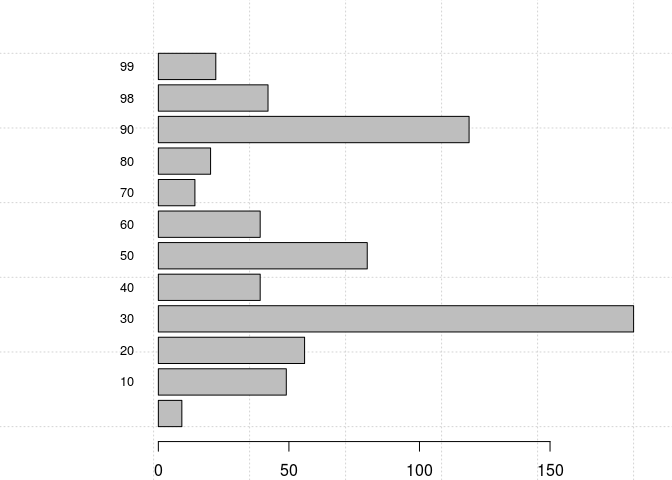
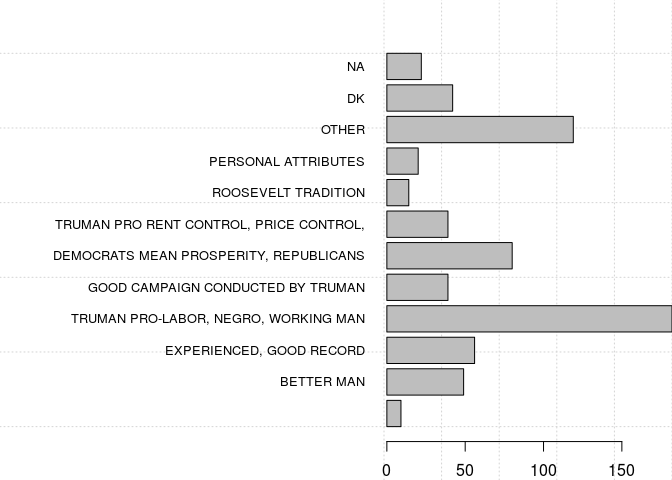

Overview
--------

This document will explore using Metadata Technology North America's (MTNA) Rich Data Services (RDS) and how to integrate it with R. MTNA has written an RDS package for R that provides functions to efficiently access the data and metadata stored in a RDS server. This document serves as an example of how to access and use the two data functions provided, select and tabulate. In this example we will be using data from the American National Election Study in 1948. We have this stored on MTNA's public RDS server at {host}.

    ## Visit http://strengejacke.de/sjPlot for package-vignettes.

Selecting data
--------------

To access the data for a view we will use the **select** function, we will need to supply a base URL, collection, and view at the bare minimum. In this case lets assume that we want to take a look at all the variables that related to Harry S. Truman. To do that we will specify **cols=$truman** indicating that we want all the variables that have Truman in the metadata (name, label, description, or question text) that accompanies the data in the RDS server.

Be aware that RDS puts a default limit of 10,000 cells to enchance the performance of the application. For small data sets or subsets this may not affect much, but if you are working with a larger data set it may be better to download the dataset in its entirety using the RDS packaging services rather than access the data over a network.

The **select** function will return an **rds.dataset** object, which contains metadata (**rds.metadata**), data (**data.frame**), and info (**data.frame**). The **rds.metadata** object has methods that allow for quick and convenient access to the variable and classification metadata that is returned with the select query.

For the sake of brevity and saving space in our HTML browser, we will limit the output to the first 10 rows returned by the query. Notice that in the info section returned we can tell if there is more data to be returned for this query. Both columns and records can be paged by adjusting the **limit**, **offset**, **colLimit**, or **colOffset.** parameters.

``` r
trumanData <- select("http://localhost:8080/rds/api/catalog/","test","NES1948",cols="$truman",limit=10)
data <- trumanData@data
info <- trumanData@info
dataTable <- sjPlot::sjt.df(data, useViewer = F,describe=FALSE,encoding = "UTF-8", no.output=TRUE, altr.row.col=TRUE,show.rownames=FALSE)$knitr
infoTable <- sjPlot::sjt.df(info, useViewer = F,describe=FALSE,encoding = "UTF-8", no.output=TRUE, altr.row.col=TRUE,show.rownames=FALSE)$knitr
```

### Data

<table style="border-collapse:collapse; border:none;">
<tr>
<th style="border-top: double; text-align:center; font-style:italic; font-weight:normal; padding:0.2cm; border-bottom:1px solid black;">
V480014a
</th>
<th style="border-top: double; text-align:center; font-style:italic; font-weight:normal; padding:0.2cm; border-bottom:1px solid black;">
V480014b
</th>
<th style="border-top: double; text-align:center; font-style:italic; font-weight:normal; padding:0.2cm; border-bottom:1px solid black;">
V480015a
</th>
<th style="border-top: double; text-align:center; font-style:italic; font-weight:normal; padding:0.2cm; border-bottom:1px solid black;">
V480015b
</th>
<th style="border-top: double; text-align:center; font-style:italic; font-weight:normal; padding:0.2cm; border-bottom:1px solid black;">
V480031a
</th>
<th style="border-top: double; text-align:center; font-style:italic; font-weight:normal; padding:0.2cm; border-bottom:1px solid black;">
V480031b
</th>
<th style="border-top: double; text-align:center; font-style:italic; font-weight:normal; padding:0.2cm; border-bottom:1px solid black;">
V480031c
</th>
<th style="border-top: double; text-align:center; font-style:italic; font-weight:normal; padding:0.2cm; border-bottom:1px solid black;">
V480033a
</th>
<th style="border-top: double; text-align:center; font-style:italic; font-weight:normal; padding:0.2cm; border-bottom:1px solid black;">
V480033b
</th>
<th style="border-top: double; text-align:center; font-style:italic; font-weight:normal; padding:0.2cm; border-bottom:1px solid black;">
V480035a
</th>
<th style="border-top: double; text-align:center; font-style:italic; font-weight:normal; padding:0.2cm; border-bottom:1px solid black;">
V480035b
</th>
</tr>
<tr>
<td style="padding:0.2cm; text-align:left; vertical-align:top; text-align:center;">
30
</td>
<td style="padding:0.2cm; text-align:left; vertical-align:top; text-align:center;">
91
</td>
<td style="padding:0.2cm; text-align:left; vertical-align:top; text-align:center;">
98
</td>
<td style="padding:0.2cm; text-align:left; vertical-align:top; text-align:center;">
91
</td>
<td style="padding:0.2cm; text-align:left; vertical-align:top; text-align:center;">
10
</td>
<td style="padding:0.2cm; text-align:left; vertical-align:top; text-align:center;">
0
</td>
<td style="padding:0.2cm; text-align:left; vertical-align:top; text-align:center;">
0
</td>
<td style="padding:0.2cm; text-align:left; vertical-align:top; text-align:center;">
0
</td>
<td style="padding:0.2cm; text-align:left; vertical-align:top; text-align:center;">
0
</td>
<td style="padding:0.2cm; text-align:left; vertical-align:top; text-align:center;">
0
</td>
<td style="padding:0.2cm; text-align:left; vertical-align:top; text-align:center;">
0
</td>
</tr>
<tr>
<td style="padding:0.2cm; text-align:left; vertical-align:top; text-align:center; background-color:#eaeaea;">
30
</td>
<td style="padding:0.2cm; text-align:left; vertical-align:top; text-align:center; background-color:#eaeaea;">
50
</td>
<td style="padding:0.2cm; text-align:left; vertical-align:top; text-align:center; background-color:#eaeaea;">
30
</td>
<td style="padding:0.2cm; text-align:left; vertical-align:top; text-align:center; background-color:#eaeaea;">
91
</td>
<td style="padding:0.2cm; text-align:left; vertical-align:top; text-align:center; background-color:#eaeaea;">
13
</td>
<td style="padding:0.2cm; text-align:left; vertical-align:top; text-align:center; background-color:#eaeaea;">
11
</td>
<td style="padding:0.2cm; text-align:left; vertical-align:top; text-align:center; background-color:#eaeaea;">
0
</td>
<td style="padding:0.2cm; text-align:left; vertical-align:top; text-align:center; background-color:#eaeaea;">
83
</td>
<td style="padding:0.2cm; text-align:left; vertical-align:top; text-align:center; background-color:#eaeaea;">
0
</td>
<td style="padding:0.2cm; text-align:left; vertical-align:top; text-align:center; background-color:#eaeaea;">
22
</td>
<td style="padding:0.2cm; text-align:left; vertical-align:top; text-align:center; background-color:#eaeaea;">
0
</td>
</tr>
<tr>
<td style="padding:0.2cm; text-align:left; vertical-align:top; text-align:center;">
10
</td>
<td style="padding:0.2cm; text-align:left; vertical-align:top; text-align:center;">
30
</td>
<td style="padding:0.2cm; text-align:left; vertical-align:top; text-align:center;">
30
</td>
<td style="padding:0.2cm; text-align:left; vertical-align:top; text-align:center;">
91
</td>
<td style="padding:0.2cm; text-align:left; vertical-align:top; text-align:center;">
10
</td>
<td style="padding:0.2cm; text-align:left; vertical-align:top; text-align:center;">
0
</td>
<td style="padding:0.2cm; text-align:left; vertical-align:top; text-align:center;">
0
</td>
<td style="padding:0.2cm; text-align:left; vertical-align:top; text-align:center;">
0
</td>
<td style="padding:0.2cm; text-align:left; vertical-align:top; text-align:center;">
0
</td>
<td style="padding:0.2cm; text-align:left; vertical-align:top; text-align:center;">
23
</td>
<td style="padding:0.2cm; text-align:left; vertical-align:top; text-align:center;">
0
</td>
</tr>
<tr>
<td style="padding:0.2cm; text-align:left; vertical-align:top; text-align:center; background-color:#eaeaea;">
30
</td>
<td style="padding:0.2cm; text-align:left; vertical-align:top; text-align:center; background-color:#eaeaea;">
91
</td>
<td style="padding:0.2cm; text-align:left; vertical-align:top; text-align:center; background-color:#eaeaea;">
10
</td>
<td style="padding:0.2cm; text-align:left; vertical-align:top; text-align:center; background-color:#eaeaea;">
91
</td>
<td style="padding:0.2cm; text-align:left; vertical-align:top; text-align:center; background-color:#eaeaea;">
11
</td>
<td style="padding:0.2cm; text-align:left; vertical-align:top; text-align:center; background-color:#eaeaea;">
0
</td>
<td style="padding:0.2cm; text-align:left; vertical-align:top; text-align:center; background-color:#eaeaea;">
0
</td>
<td style="padding:0.2cm; text-align:left; vertical-align:top; text-align:center; background-color:#eaeaea;">
0
</td>
<td style="padding:0.2cm; text-align:left; vertical-align:top; text-align:center; background-color:#eaeaea;">
0
</td>
<td style="padding:0.2cm; text-align:left; vertical-align:top; text-align:center; background-color:#eaeaea;">
22
</td>
<td style="padding:0.2cm; text-align:left; vertical-align:top; text-align:center; background-color:#eaeaea;">
0
</td>
</tr>
<tr>
<td style="padding:0.2cm; text-align:left; vertical-align:top; text-align:center;">
30
</td>
<td style="padding:0.2cm; text-align:left; vertical-align:top; text-align:center;">
60
</td>
<td style="padding:0.2cm; text-align:left; vertical-align:top; text-align:center;">
10
</td>
<td style="padding:0.2cm; text-align:left; vertical-align:top; text-align:center;">
91
</td>
<td style="padding:0.2cm; text-align:left; vertical-align:top; text-align:center;">
11
</td>
<td style="padding:0.2cm; text-align:left; vertical-align:top; text-align:center;">
12
</td>
<td style="padding:0.2cm; text-align:left; vertical-align:top; text-align:center;">
0
</td>
<td style="padding:0.2cm; text-align:left; vertical-align:top; text-align:center;">
19
</td>
<td style="padding:0.2cm; text-align:left; vertical-align:top; text-align:center;">
83
</td>
<td style="padding:0.2cm; text-align:left; vertical-align:top; text-align:center;">
22
</td>
<td style="padding:0.2cm; text-align:left; vertical-align:top; text-align:center;">
0
</td>
</tr>
<tr>
<td style="padding:0.2cm; text-align:left; vertical-align:top; text-align:center; background-color:#eaeaea;">
30
</td>
<td style="padding:0.2cm; text-align:left; vertical-align:top; text-align:center; background-color:#eaeaea;">
91
</td>
<td style="padding:0.2cm; text-align:left; vertical-align:top; text-align:center; background-color:#eaeaea;">
99
</td>
<td style="padding:0.2cm; text-align:left; vertical-align:top; text-align:center; background-color:#eaeaea;">
91
</td>
<td style="padding:0.2cm; text-align:left; vertical-align:top; text-align:center; background-color:#eaeaea;">
12
</td>
<td style="padding:0.2cm; text-align:left; vertical-align:top; text-align:center; background-color:#eaeaea;">
11
</td>
<td style="padding:0.2cm; text-align:left; vertical-align:top; text-align:center; background-color:#eaeaea;">
0
</td>
<td style="padding:0.2cm; text-align:left; vertical-align:top; text-align:center; background-color:#eaeaea;">
68
</td>
<td style="padding:0.2cm; text-align:left; vertical-align:top; text-align:center; background-color:#eaeaea;">
0
</td>
<td style="padding:0.2cm; text-align:left; vertical-align:top; text-align:center; background-color:#eaeaea;">
0
</td>
<td style="padding:0.2cm; text-align:left; vertical-align:top; text-align:center; background-color:#eaeaea;">
0
</td>
</tr>
<tr>
<td style="padding:0.2cm; text-align:left; vertical-align:top; text-align:center;">
98
</td>
<td style="padding:0.2cm; text-align:left; vertical-align:top; text-align:center;">
91
</td>
<td style="padding:0.2cm; text-align:left; vertical-align:top; text-align:center;">
90
</td>
<td style="padding:0.2cm; text-align:left; vertical-align:top; text-align:center;">
91
</td>
<td style="padding:0.2cm; text-align:left; vertical-align:top; text-align:center;">
0
</td>
<td style="padding:0.2cm; text-align:left; vertical-align:top; text-align:center;">
0
</td>
<td style="padding:0.2cm; text-align:left; vertical-align:top; text-align:center;">
0
</td>
<td style="padding:0.2cm; text-align:left; vertical-align:top; text-align:center;">
0
</td>
<td style="padding:0.2cm; text-align:left; vertical-align:top; text-align:center;">
0
</td>
<td style="padding:0.2cm; text-align:left; vertical-align:top; text-align:center;">
23
</td>
<td style="padding:0.2cm; text-align:left; vertical-align:top; text-align:center;">
0
</td>
</tr>
<tr>
<td style="padding:0.2cm; text-align:left; vertical-align:top; text-align:center; background-color:#eaeaea;">
50
</td>
<td style="padding:0.2cm; text-align:left; vertical-align:top; text-align:center; background-color:#eaeaea;">
90
</td>
<td style="padding:0.2cm; text-align:left; vertical-align:top; text-align:center; background-color:#eaeaea;">
90
</td>
<td style="padding:0.2cm; text-align:left; vertical-align:top; text-align:center; background-color:#eaeaea;">
91
</td>
<td style="padding:0.2cm; text-align:left; vertical-align:top; text-align:center; background-color:#eaeaea;">
10
</td>
<td style="padding:0.2cm; text-align:left; vertical-align:top; text-align:center; background-color:#eaeaea;">
12
</td>
<td style="padding:0.2cm; text-align:left; vertical-align:top; text-align:center; background-color:#eaeaea;">
0
</td>
<td style="padding:0.2cm; text-align:left; vertical-align:top; text-align:center; background-color:#eaeaea;">
0
</td>
<td style="padding:0.2cm; text-align:left; vertical-align:top; text-align:center; background-color:#eaeaea;">
0
</td>
<td style="padding:0.2cm; text-align:left; vertical-align:top; text-align:center; background-color:#eaeaea;">
0
</td>
<td style="padding:0.2cm; text-align:left; vertical-align:top; text-align:center; background-color:#eaeaea;">
0
</td>
</tr>
<tr>
<td style="padding:0.2cm; text-align:left; vertical-align:top; text-align:center;">
50
</td>
<td style="padding:0.2cm; text-align:left; vertical-align:top; text-align:center;">
30
</td>
<td style="padding:0.2cm; text-align:left; vertical-align:top; text-align:center;">
30
</td>
<td style="padding:0.2cm; text-align:left; vertical-align:top; text-align:center;">
90
</td>
<td style="padding:0.2cm; text-align:left; vertical-align:top; text-align:center;">
10
</td>
<td style="padding:0.2cm; text-align:left; vertical-align:top; text-align:center;">
0
</td>
<td style="padding:0.2cm; text-align:left; vertical-align:top; text-align:center;">
0
</td>
<td style="padding:0.2cm; text-align:left; vertical-align:top; text-align:center;">
0
</td>
<td style="padding:0.2cm; text-align:left; vertical-align:top; text-align:center;">
0
</td>
<td style="padding:0.2cm; text-align:left; vertical-align:top; text-align:center;">
23
</td>
<td style="padding:0.2cm; text-align:left; vertical-align:top; text-align:center;">
0
</td>
</tr>
<tr>
<td style="padding:0.2cm; text-align:left; vertical-align:top; text-align:center; background-color:#eaeaea;">
30
</td>
<td style="padding:0.2cm; text-align:left; vertical-align:top; text-align:center; background-color:#eaeaea;">
90
</td>
<td style="padding:0.2cm; text-align:left; vertical-align:top; text-align:center; background-color:#eaeaea;">
90
</td>
<td style="padding:0.2cm; text-align:left; vertical-align:top; text-align:center; background-color:#eaeaea;">
91
</td>
<td style="padding:0.2cm; text-align:left; vertical-align:top; text-align:center; background-color:#eaeaea;">
0
</td>
<td style="padding:0.2cm; text-align:left; vertical-align:top; text-align:center; background-color:#eaeaea;">
0
</td>
<td style="padding:0.2cm; text-align:left; vertical-align:top; text-align:center; background-color:#eaeaea;">
0
</td>
<td style="padding:0.2cm; text-align:left; vertical-align:top; text-align:center; background-color:#eaeaea;">
0
</td>
<td style="padding:0.2cm; text-align:left; vertical-align:top; text-align:center; background-color:#eaeaea;">
0
</td>
<td style="padding:0.2cm; text-align:left; vertical-align:top; text-align:center; background-color:#eaeaea;">
12
</td>
<td style="padding:0.2cm; text-align:left; vertical-align:top; text-align:center; background-color:#eaeaea;">
0
</td>
</tr>
</table>
### Info

<table style="border-collapse:collapse; border:none;">
<tr>
<th style="border-top: double; text-align:center; font-style:italic; font-weight:normal; padding:0.2cm; border-bottom:1px solid black;">
colOffset
</th>
<th style="border-top: double; text-align:center; font-style:italic; font-weight:normal; padding:0.2cm; border-bottom:1px solid black;">
colCount
</th>
<th style="border-top: double; text-align:center; font-style:italic; font-weight:normal; padding:0.2cm; border-bottom:1px solid black;">
moreCols
</th>
<th style="border-top: double; text-align:center; font-style:italic; font-weight:normal; padding:0.2cm; border-bottom:1px solid black;">
format
</th>
<th style="border-top: double; text-align:center; font-style:italic; font-weight:normal; padding:0.2cm; border-bottom:1px solid black;">
includeMetadata
</th>
<th style="border-top: double; text-align:center; font-style:italic; font-weight:normal; padding:0.2cm; border-bottom:1px solid black;">
limit
</th>
<th style="border-top: double; text-align:center; font-style:italic; font-weight:normal; padding:0.2cm; border-bottom:1px solid black;">
offset
</th>
<th style="border-top: double; text-align:center; font-style:italic; font-weight:normal; padding:0.2cm; border-bottom:1px solid black;">
moreRows
</th>
</tr>
<tr>
<td style="padding:0.2cm; text-align:left; vertical-align:top; text-align:center;">
0
</td>
<td style="padding:0.2cm; text-align:left; vertical-align:top; text-align:center;">
11
</td>
<td style="padding:0.2cm; text-align:left; vertical-align:top; text-align:center;">
FALSE
</td>
<td style="padding:0.2cm; text-align:left; vertical-align:top; text-align:center;">
MTNA
</td>
<td style="padding:0.2cm; text-align:left; vertical-align:top; text-align:center;">
TRUE
</td>
<td style="padding:0.2cm; text-align:left; vertical-align:top; text-align:center;">
10
</td>
<td style="padding:0.2cm; text-align:left; vertical-align:top; text-align:center;">
0
</td>
<td style="padding:0.2cm; text-align:left; vertical-align:top; text-align:center;">
TRUE
</td>
</tr>
</table>
Tabulating Data
---------------

RDS has a **tabulate** function that allows users to create tabulations and aggregations. In this example we will look at variable V480014a, *Why People Voted for Truman*. By default the measures returned will be the count of each value in the variable, but they can also be other aggregations, which are listed in the tabulate function documentation.

The tabulate function will return the same **rds.dataset** object that the select function did.

``` r
tabData <- rds::tabulate("http://localhost:8080/rds/api/catalog/", 
    "test", "NES1948", dimensions = "V480014a")
data <- tabData@data
par(mar = c(2, 8, 2, 2))
bar <- barplot(data$count, horiz = TRUE, panel.first = grid(), 
    las = 1, names.arg = data$V480014a, cex.names = 0.8)
```



------------------------------------------------------------------------

So now we have created a bar chart for the frequencies of variable **V480014a**, so what if we want to show a bar, pie, or any other chart with the code values rather than the codes? We can use the **inject** parameter to specify that we want the codes returned to be replaced with their code values.

``` r
tabData <- rds::tabulate("http://localhost:8080/rds/api/catalog/","test","NES1948",dimensions="V480014a",inject=TRUE)
data <- tabData@data
par(mar=c(2, 20, 2, 0))
bar <- barplot(data$count,horiz=TRUE, panel.first=grid(), las = 1, names.arg=data$V480014a, cex.names=0.8)
```

 <br/><br/><br/><br/>
